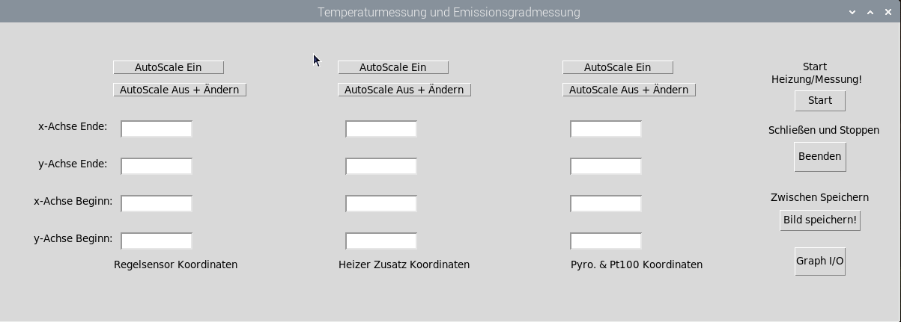
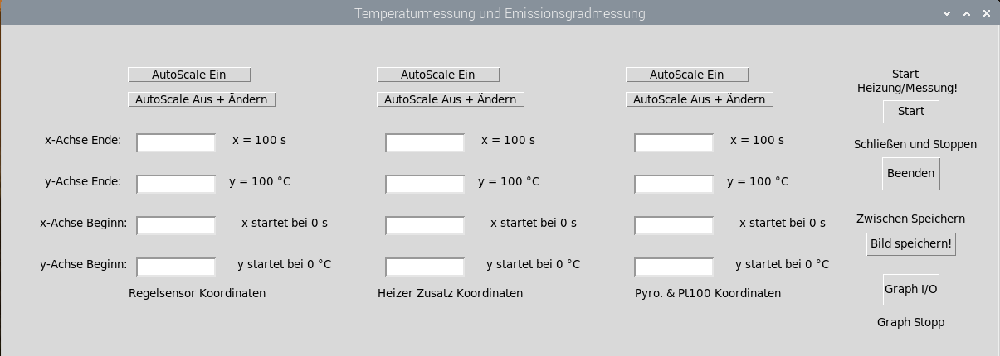
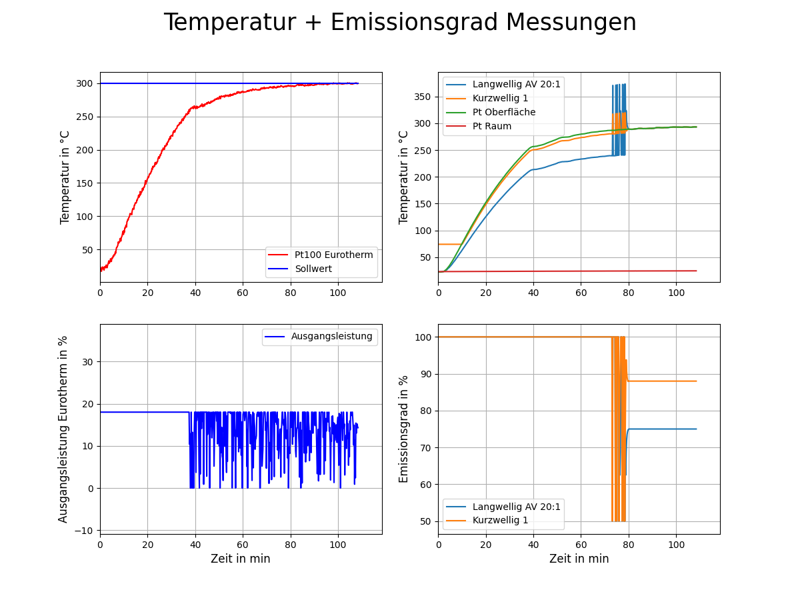
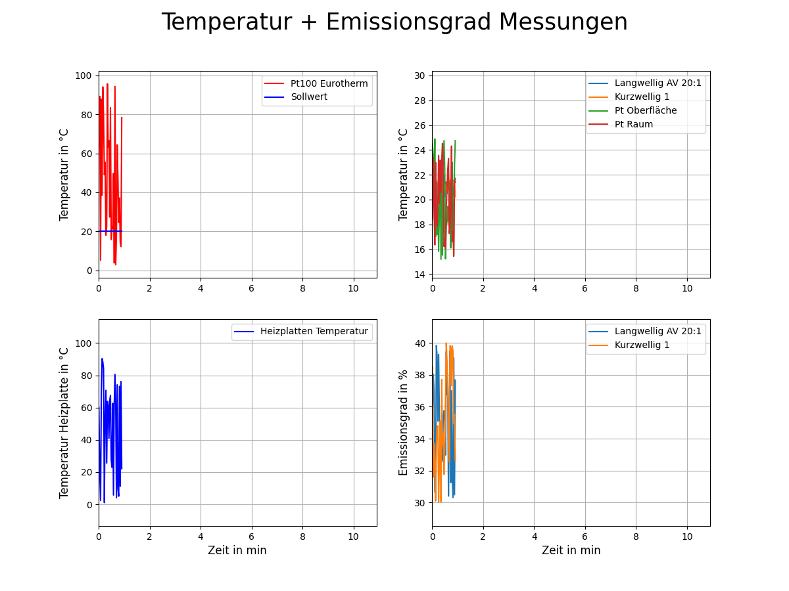
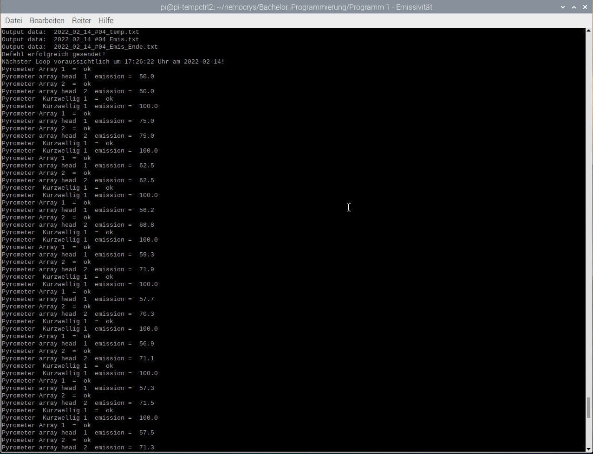
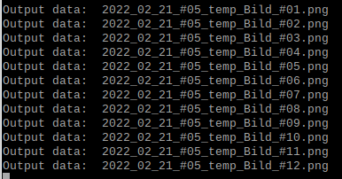
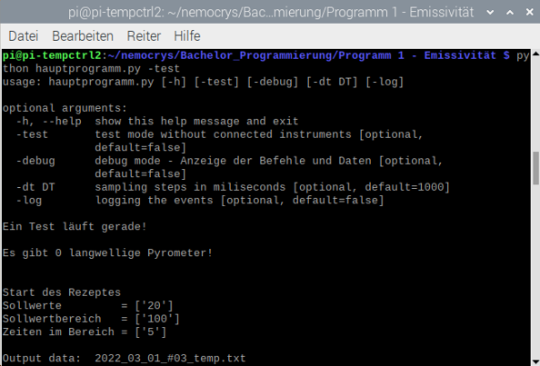

# Emissionsgradmessungen:

Mit diesem Programm sollen in der Test-CZ Anlage verschiedene Emissionsgrade von verschiedenen Materialien gemessen werden. Das Programm baut auf dem des Praktikums auf und wird im Folge meiner Bachelorarbeit optimiert und an neue Anforderungen angepasst. 

Im Ordner "Infos" findet man weitere Markdown Dateien die Information über die genutzten Quellen (Manuals), über die Bedienung und Befehle der Geräte, sowie die genutzten Geräte zeigen. 

---    

## 1. Zum Programm
Das Programm basiert auf dem erarbeiteten Programm aus meinem Praktikum. So wurden die verschiedenen Funktionen der Bibliotheken der Geräte nun hier in Klassen eingeordnet. Zudem sind Teile aus dem Hauptprogramm übernommen. Auch die GUI die mit tkinter erstellt wird ist hauptsächlich aus dem alten Programm übernommen. 

### 1.1. Programme

1. **hauptprogramm.py:**   
    Im hauptprogramm.py werden die Geräte initialisiert, Grafiken gestartet, Files erzeugt und mit den Messdaten belegt, sowie die Emissionsgradanpassung erzeugt. Zudem werden die Test und Debug Werte an die Gerätebibliotheken gesendet, Eurotherm Heizer bekommt ein Delay und wenn gewollt eine weitere Schnittstelle. Mit dieser Schnittstelle wird ein Arduino als Leistungssteuerung für das Eurotherm initialisiert. Mit dem Arduino Programm in  Ordner Emulation_Eurotherm kann man auch den Eurotherm mit dem Arduino ersetzen, Arduino soll als Emulation des Eurotherms dienen. 

    *Funktionen:*     
    - **Init_File()**   
    In dieser Funktion werden die drei Files erzeugt und bekommen ihren Kopf.
        - *_temp.txt - Sammlung der Temperaturmesswerte
        - *_Emis.txt - Sammlung der Anpassungsversuche und Abschlüsse (bzw. alle Messwerte der Anpassung stehen hier)
        - *_Emis_End.txt - Sammlung der Angepassten Emissionsgrade (16 Wert einer Anpassung)
    Zudem wird die Versionsnummer (von GitHub) ausgelesen und der Ordner für die Dateien wird erstellt. Die Namen (Ordner und File) richten sich nach dem Datum und werden vom Programm erzeugt. Der Index für den Filenamen wird immer anhand der vorhandenen Filenamen erzeugt und ist fortlaufend von 1.
    - **fenster_GUI()**   
    In dieser Funktion wird die GUI (Schaltoberfläche) für das Programm erzeugt. Wie oben schon erwähnt ist der große Teil aus dem alten Programm. 
    Geblieben ist:
        - Start Knopf
        - Beenden Knopf
        - Manuelle Achsenanpassung für die Temperaturkurven
        - Umschsalt Knöpfe für Manuelles und Automatisches Scaling
        - Graph speichern Knopf
        - Aktualisierung Grapf ein- und ausschalten Knopf
    Die gesamte GUI wird mit Hilfe der Python Bibliothek tkinter erstellt. Mit der Funktion task() wird die Funktion get_Measurment() nach Betätigung des Start-Knopfes immer wieder aufgerufen. 
    - **get_Measurment()**
    Das ist der Kern des Programms in dem die ganzen Messungen durch geführt werden.    
    Folgendes geschieht hier:
        - Messwerte werden geholt
        - Messwert Listen werden erweitert
        - die Vergleischstemperatur wird für die Anpassung bestimmt
        - das Rezept wird bearbeitet    
            1. schauen ob Istwert in Sollwertbereich
            2. Wenn das nicht der Fall ist setzte die Anpassungsvariablen und den Emissionsgrad auf 100 wenn StartConfig = True ist, sonst wird StartConfig nur auf False gesetzt.
            3. Wenn das der Fall ist und StartConfig False ist, so wird der Start des nächsten Loops anhand des Rezeptes berechnet und die Anpassung gestartet. Diese Anpassung wird 16 mal durchgeführt (16 weil "<=15", bedeutet 0 bis 15). Das Prinzip der Anpassung wird später noch näher erklärt.    
            Als nächstes wird geschaut ob der Zyklus abgeschlossen wurde. Wenn ja so wird dem Heizer die nächste Solltemperatur übergeben. Ist der letzte Zyklus erreicht, so wird das Programm folgend beendet und das aktuelle Bild gespeichert. Wenn der Stop Graph Knopf betätigt wurde, so wird die Grafik komplett neu erstellt und gespeichert.
            4. Wenn der Sollwertbereich vorzeitig verlassen wird, dann wird die Anpassung nach Schritt 2 abgebrochen und alles auf 100 zurückgesetzt. und das Programm wartet bis der Bereich wieder erreicht wird.
            5. Die *_Emis.txt und *_Emis_End.txt Datein werden im Laufe der Anpassung gefüllt. 
            
            Notiz:     
            Das * steht für das Datum und den Index der Datei. Der Dateiname wird anhand des Datums erstellt.
        
        - Temperatur Daten werden in File *temp.txt eingetragen
        - Graph wird aktualisiert (Autoscaling und Daten)
	- Bei Betätigen des "Graph I/O" Knopfes und des Anhalten des Graphen somit, wird bei Beendigung des Programms die Bild Datei "*temp_Bild_Rezept_End.png" erstellt. Das Layout dieses Bildes ist das selbe wie für "*temp_Bild.png". Am Ende wird so ein vollständiges Bild erzeugt und zudem das angehaltene Diagramm auch gespeichert. Dies wurde eingeführt, da im Praktikum die Graphen immer zu unterschiedlichen Zeiten einfach hingen blieben und erst geupdatet wurden, wenn die Maus bewegt wurde. 
    - **Update_Graph(Kurve, Update_Y)**   
    Diese Funktion stammt aus dem alten Programm und updatet die x- und y-Daten des jeweiligen Graphen. Diese Funktion existiert um Redundanz zu vermeiden, jedoch ist sie hier nur noch für die Heizer zuständig. Die Adafruit Module und Pyrometer haben dies in ihrem Objekt mit drin. 
    - **AutoScroll(Graph, AutoStop, xVon, xEnde, yVon, yEnde, minusY, plusY)**   
    Mit dieser Funktion werden die Graphen immer in "Bewegung" gehalten. Wenn das Autoscaling durch Kopf Druck ausgeschaltet wurde, wird hier dem Graphen nur die eingegebenen Werte übermittelt. Ist es eingeschaltet so wird der Maximal und Minimal Wert der y-Achse ermittelt und dann mit dem Zusatzwerten (minusY und plusY) verrechnet. Bei der x-Achse wird immer die selbe Liste verwendet, nämlich die der Zeit. Um den Rand etwas fernzuhalten wird hier ein Zusatz von 10 auf den letzten Wert der Zeitliste hinzugefügt. Den Rest macht das Programm.
    - **Emissions_Anpassung(Temp_Pyro, Temp_Oberf, e_Alt, e_Drauf, o_Grenze, u_Grenze)**     
    In dieser Funktion wird die Anpassung der Emissionsgrade bzw. die Temperaturen werden angepasst und der Emissionsgrad wird lediglich verändert.   
    *Prinzip:*   
    Das Prinzip der Anpassung ist ein Näherungsverfahren, durch ständige Änderung des Emissionsgrad und Vergleich der Temperaturen wird der Emissionsgrad bestimmt.     
    Die Variable "e_Drauf" spielt hier eine große Rolle. Diese Variable wird halbiert wenn die Temperaturen ungleich sind. Der Anfangswert der Variable ist 100. 100 % ist auch die Obergrenze für die Anpassung und wird nicht überschritten! Mit jeder Runde in der Anpassung wird geschaut ob die Temperatur des Pyrmonters größer oder kleiner ist als die Temperatur des Vergleichssensors (am besten Oberflächentemperatur)(ist die Temperatur des Pyrmonters schon zu Beginn größer so bleibt der Emissionsgrad bei 100 %).    
    In jeder Runde wird die Variable "e_drauf" halbiert, das heißt die Variable entwickelt sich wie folgt:   
        - 100 -> 50 -> 25 -> 12,5 -> 6,25 -> 3,125 -> 1,5625 -> 0,78125 -> 0,390625 -> 0,1953125 -> 0,09765625 -> ...   
    
        Besonders zu beachten ist das der Emissionsgrad für die Pyrmonter nur eine Nachkommastelle besitzt. Das heißt mehr als 16 Anpassung sind nutzlos. Nach der 10 Halbierung ist der Wert schon zu klein. Dieser Wert wird nun je Runde von dem alten Emissionsgrad abgezogen oder auf diesen addiert. Durch dieses Prozedere wird sich immer mehr an die Vergleichstemperatur angenähert und wenn sie dann sich überlappen, weiß man den Emissionsgrad des Materials. 
    - **Emis_Update()**    
    In dieser Funktion werden die Emissionsgrad Listen der Pyrometer aktualisiert. Diese Funktion brauch man da diese Aktualisierung an zwei verschiedenen Plätzen vorgenommen werden muss. 
    Notiz:   
    Nach der Anpassung dies nur einmal aufrufen würde nicht klappen, da bei Ende der letzte Wert nicht eingetragen würde!
    - **save()**  
    Diese Funktion dient dem Zwischenspeichern der Grafik.
    - **Start()**     
    Diese Funktion wird durch den Start-Knopf aktiviert und tut folgendes:    
        - Ruft Init_File() auf
        - Startet die IKA Heizplatte wenn ausgewählt
        - Erstellt die Grafik für Temperatur- und Emissionsgradmessung (bei Arduino/Eurotherm auch Leistungsmessung)
            - Live-Plot
    - **Stop()**    
    Diese Funktion wird durch den Beenden-Knopf aktiviert oder wenn das Rezept beendet ist. Folgendes wird hier erreicht:   
        - Stoppt die IKA Heizplatte wenn ausgewählt
        - speichert die Grafik die offen ist     
        - setzt den Sollwert (bei Eurotherm Auswahl) auf 20 °C und fragt um ihn zusetzten (bei Arduino) noch mal den OP (Leistungswert) ab
    
    *Sonstiges:*
    1. Parameterliste wird eingelesen
    2. Überprüfung der Eingabe Werte (python Bibliothek argparse genutzt):
        - -test     - Startet Test Funktion
        - -debug    - Startet Debug Funktion   
        - -dt Zahl  - Abtastrate zu Beginn ändern
        - -log      - Erzeugt eine Log Datei mit allen Ereignissen
    3. Test- und Debug-Funktion wird für die Geräte bestimmt und an deren Bibliotheken übergeben
    4. Log-datei wird erstellt wenn -log durch Konsolen Eingabe gestartet wird
        - Übergabe des Loggings an die Geräte Bibliotheken
    5. Geräte werden initialisiert 
    6. Rezept wird eingelesen
    7. GUI wird gestartet             

2. **config_Parameter.yml**   
Diese Datei wird von Hauptprogramm mithilfe der Python Bibliothek yaml ausgelesen. In der Datei befinden sich viele Dictioneries. In dieser Datei stehen die Initialisierungsparameter für die Geräte und weitere Strings (wie der Name der Rezeptdatei und des Regelsensors). Auch die Heizer Auswahl und die Anzahl an Messgeräten kann man über die Datei regeln. Wenn man ein Gerät während der Messung nicht haben möchte, so kann man in dieser Datei das gesamte Gerät einfach auskommentieren und somit würde das Gerät nicht im Programm genutzt werden. 

3. **heizer.py**     
In der Datei befinden sich alle Befehle für die beiden derzeitigen Heizer. Die Funktionen für die Heizplatte von IKA stammen aus dem Praktikum. Die Funktionen für den Eurotherm sind neu und werden später noch erläutert (Ordner "Infos"). 

    Im laufe der Bearbeitung, auf Grund von Fehlern, wurde eine Emulation für Eurotherm entwickelt. Dieses Arduino Programm kann einerseits das Eurotherm Gerät ersetzen oder andererseits nur die Leistungssteuerung der Heizplatte bzw. die Leistungsausgabe für den Grafitheizer übernehmen. 

4. **pyrometer.py**    
Im Praktikums Programm waren die kurz- und langwelligen Pyrometer getrennt von einander. In diesem sind die Funktionen nun in einer Datei. Die Funktionen wurden mir vom IKZ gegeben.

5. **adafruit.py**    
Auch die Funktionen stammen aus dem Praktikum. Später wird noch die Quelle bzw. der Ort des Programms genannt (Ordner "Infos"). 

    Um die Module initialisieren zu können benötigt man die GPIO Adresse an dem das Modul befestigt ist (Pin am Raspberry Pi). Über die Yaml Datei ist dies in der Weise wie man es brauch (so z.B.: board.D16) nicht übergebbar, da es als String übergeben wird. Die Lösung ist hier ein Dictionarie mit allen Adressen (Pin-belegungen für GPIO). Der Schlüssel wird über die Yaml Datei übergeben und das Programm holt sich den richtigen Wert.

### 1.2. Übernommen aus exp-T-control     
Übernommen wurde:   
1. Hauptprogramm.py (später nur an neue Anforderungen angepasst)
2. die Funktionen für adafruit.py, pyrometer.py und heizer.py (Heizplatte)
3. die GUI (später nur an neue Anforderungen angepasst)

### 1.3. Angepasstes und Neues
Neu in dem Programm ist:    
1. Objektorientierte Programmierung
    - Die Heizer, die Pyrometer und die Adafruit (Pt100) werden alle nun durch Klassen initialisiert, das verbessert das Hauptprogramm sehr. 
    - Die übernommenen Funktionen sind nun Teil einer Klasse.
    - Durch die Klassen ist es leichter das Programm um die Geräte zu erweitern.
2. Parameterliste    
    - Auch diese erleichtert die Erweiterung der Geräte.
    - Alles was an wichtigen und ständig änderten Variablen existiert kann in der Datei angegeben werden und ausgelesen werden.
3. Nur noch Rezept-Modus
    - Im alten Programm konnte man die Rezepte nur mit -cfg name im Konsolenfenster starten, nun übergibt man den Namen des Rezeptes über die Parameterliste.
    - Das neue Programm wurde um alle Manuellen Eingabemöglichkeiten erleichtert, das bedeutet das die Schaltoberfläche (GUI) verringert wird.   
    Raus fliegen tut z.B. die Eingabe des Emissionsgrades und der Sollwerttemperatur, da diese über das Rezept geändert und vorgegeben werden. 
    - Auch der Stopp Knopf wurde entfernt, nun gibt es nur noch Start und Beenden.

### 1.4. GUI
Auch die GUI wurde angepasst aus dem vorigen Programm. Viele Teile der GUI wurden entfernt und nur noch Rezept spezifische Befehle sind geblieben. Kurz gesagt alles was eine Manuelle Änderung am Sollwert oder Emissionsgrad vornimmt wurde entfernt.    
Die neue GUI sieht wie folgt aus:    

 

Wenn man die Knöpfe betätigt werden folgende Notizen frei:
 

Die GUI wird durch die Python Bibliothek **tkinter** erzeugt. Für diese GUI werden in dem Programm die Positionen Fix vom Programmierer festgelegt. Um die einzelnen Bauteile (Knöpfe, Labels und Eingabefelder) zu positionieren nennt man dem Programm die x- und y-Koordinaten und die Höhe und Breite der Bauteile. 

**ACHTUNG:** Von Betriebssystem zu Betriebssystem kann sich die GUI verändern!

*Was geschieht bei den einzelnen Knöpfen:*
1. AutoScale Ein   
    Diese Knöpfe stellen das Automatische anpassen der x- und y-Achse wieder ein. Nur für das Emissionsgrad Diagramm gibt es das nicht.
2. AutoScale Aus + Ändern    
    Diese Knöpfe verursachen das die Werte der ihnen unterstehenden Eingabefelder eingelesen werden und in der Notiz daneben angezeigt werden. Wenn ein oder alle Felder leer sind wenn der Knopf betätigt ist werden die Default Werte als Skalierung der Achsen eingesetzt und angezeigt. Diese sind bei der x- und y-Achse jeweils von 0 bis 100. 
3. Start   
    Bei drücken dieses Knopfes passiert einiges:   
    1. Erstelle die Files für die Daten
    2. Wenn die IKA Heizplatte ausgewählt wurde, wird diese Gestartet
    3. Erzeuge die Grafik
    4. nStart = True
        - diese Variable ist zu Beginn auf False gesetzt, solange diese False ist wird die Funktion task() übersprungen und alle 10 ms prüfen ob sich dies geändert hat, dadurch kann die Messungen solange nicht beginnen, solange Start nicht betätigt wurde
        - die Funktionen save(), Stop() und get_Measurment() können bei nStart = False nichts tun
        - Sobald es auf True steht werden die anderen Funktionen freigeschaltet und die Funktion Start() wird verriegelt
4. Beenden   
    Wenn Start betätigt wurde, dann wird bei Betätigung von Beenden die Funktion Stop() ausgeführt und das Programm danach beendet. Ohne Betätigung von Start wird Stop() übersprungen und das Programm beendet.

5. Bild speichern!   
    Sobald ein Graph da ist kann man mit diesem Knopf Zwischen Bilder speichern.

6. Graph I/O   
    Mit diesem Knopf kann man verursachen das der Live-Plot in get_Measurment() aktualisiert wird. Die Betätigung toggelt eine Variable zwischen False und True. Sobald die Variable auf True steht steht der Live-Plot still, egal was man macht, auch das AutoScale verursacht nichts bis der Knopf erneut gedrückt wird!    
    Eine Notiz unter dem Knopf nennt den aktuellen Status der Variable! 

### 1.5. Grafik:
Auch die Grafik wurde weitesgehend aus dem exp-T-control Projekt übernommen. geändert hat sich aber trotzdem etwas:    
1. Übergabe von Labels/Legenden Namen:   
In dem neuen Programm werden einige Legendenlabels aus der Parameterliste entnommen. Z.B. die Namen für Pyrometer und Pt100. Auch der Regelsensor Name kann in der Datei geändert werden. 
2. Zusatzdiagram:    
Je nach dem welcher Heizer angegeben ist, wird eine andere Größe geplottet. Beim Eurotherm/Emulation wird die Ausgangsleistung des Reglers in % geplottet und bei der IKA Heizplatte wird die Heizplattentemperatur ausgelesen. 

**Notiz:**    
Sollten weitere Heizer hinzugefügt werden, so müsste man entweder dieses Diagramm verriegeln oder auch bei dem Heizer eine Größe dort printen lassen. Mit der v3.0 ist dieses Diagramm immer vorhanden. 
 
**Diagramm Eurotherm/Emulation:**    
 

**Diagramm Heizplatte IKA:**  
 

Oben Links:   
Das Diagramm zeigt die Isttemperatur des Regelsensors. Über die Parameterliste kann man das Legenden-Label der Kurve ändern. In dem Diagramm wird auch die Solltemperatur mit geplottet. Diese wird nicht aus den Geräten gelesen, sondern aus dem Rezept entnommen. 

Oben rechts:    
Das Diagramm zeigt die Temperaturmessdaten der Adafruit Module (Pt100 Widerstandsthermometer) und der Pyrometer. Auch hier sind die Label-Namen über die Parameterliste anpassbar.

Unten Links:     
Dieses Diagramm ist das besagte Zusatzdiagramm und zeigt derzeitig entweder die Ausgangsleistung in % oder die Heizplattentemperatur in °C. Die Label-Namen werden je nach Heizerwahl (Parameterliste) fix im Code festgelegt.

Unten Rechts:   
Das Diagramm zeigt die Emissionsgradmessung der Pyrometer. Bis zur Anpassung ist der Emissionsgrad 100 % groß. Die Labels werden durch die Parameterliste angegeben (Name des Gerätes).

Bei dem Diagramm von IKA ist gelichzeitig auch die Test-Funktion dargestellt. Das Programm gibt zufällige Werte zurück.

### 1.6. Weiters 
**Beispiel Programme/Datein:**    
In dem Ordner "Beispiel Datein" liegt ein Beispiel für ein Messrezept und für die YAML Datei. Diese können für das Programm benutzt werden. Für die Nutzung müssen die Datein in den Hauptordner gezogen werden und eventuell wegen der Schnittstelle und eines anderen Rezeptes angepasst werden. 

*Bei dem Namen der Dateien muss dann nur das "Beispiel_" entfernt werden!*

Weiterhin gibt es hier auch Bilder des Diagramms sowie die Text-Datei.

**Rezepte:**   
Ein Rezept besteht aus vielen Zyklen. Jeder Zyklus besteht aus drei Werten - der zu erreichenden Solltemperatur, die Abweichung zu dem Sollwert und wie lange in dem Sollwertbereich sich der Istwert befinden muss.  

*Beispiel:*   
zy1: 50,0.5,20    
* der Istwert soll eine Temperatur von 50 °C erreichen  
* der Sollwertbereich ist von 49,5 - 50,5 °C
* um in den nächsten Zyklus zu springen, bleibe 20 min in dem Sollwertbereich

**Konsolenstart Möglichkeiten**:   
Programm sind auch über eine Konsole (z.B. PowerShell) start bar. Mit der Python Bibliothek argparse können mit dem Start eines Programms besondere Ereignisse ermöglicht werden. Folgend werden diese erläutert:   
1. -h, --help
    - damit werden alle möglichen Startextras angezeigt
    - zudem wird das Programm beendet
2. -test   
    - mit diesem Start wird der Test Flag auf True gesetzt, wodurch die Geräte im Testmodus arbeiten und Zufallswerte ausgeben (heißt Programm ist ohne Geräte Testbar - geht aber nur auf dem richtigen "board", da die Adafruit Bibliotheken das Programm abstürzen lassen wenn das Board nicht findbar ist)
3. -debug
    - dies löst den Debug-Modus aus
    - daraufhin werden alle gesendeten Befehle und wichtige Werte im Konsolenfenster ausgegeben
4. -dt DT
    - die Abtastrate bzw. die Zeit der Wiederholung der Messwertbeschaffung kann hier von dem Default Wert 1 s abgeändert werden
    - DT ist der Platzhalter für die neue Zeit (Angabe in ms)
5. -log
    - damit wird der Startschuss gegeben eine Logging Datei zu erstellen und die Ereignisse (die im Programm definiert sind) dort einzutragen

**Konsolen Ausgabe (Stand 21.2.22):**     
 

In dem Bild kann man für ein Eurotherm Gerät sehen, wie die Ausgabe in der Konsole ist.    
Was ist zu sehen:
1. Konsolenstart Möglichkeiten
2. Emulation/Arduino wurde initialisiert (Variante 2 und 3)
3. Eurotherm Gerät wird vorbereitet
4. Pyrometer Kurzwellig wird vorbereitet
5. Pyrometer Langwellig wird vorbereitet
6. Adafruits werden vorbereitet
7. Rezept wird ausgegeben und vorbereitet

Nach betätigen von Start:    
1. Ausgabe der Filenamen
2. Ausgabe Vergleichstemperatur
3. Sollwert wird an Gerät übergeben

**Konsole während einer Anpassung:**    
        
Zu Beginn einer Anpassung wird als nächstes die Endzeit genannt. Darauf folgenden dann die Veränderungen der Emissionsgrade an den Pyrometern. 

**Weitere Konsolen Eintragungen:**     
 
Immer wenn man auf dem Bild speichern Knopf drückt, wird die Datei die erstellt wurde in der Konsole angezeigt. 

Besondere Ausgaben werden auch im Test und Debug Modus ausgegeben.  

**Konsole im Test-Modus:**    
      
  

**Konsole im Debug-Modus:**      
Im Debug Modus werden Befehle an die Geräte und Besondere Zustände wie die Fehlermeldung bei Eurotherm ausgegeben in der Konsole.     

### 1.7. Parameterliste
In dem Ordner "Beispiel Datein" ist die Liste zu finden. 

In der Datei kann man die gesamten Schnittstellen Einstellungen, bestimmte Labels und weitere Daten definieren und finden. 

Zunächst werden die gesamten Geräte erstellt. Durch anfügen von Geräten, sowie die bisherigen, kann man mehr von den Geräten hinzufügen. Durch das auskommentiern/löschen der Geräte kann man verhindern das das Gerät in der Messung verwendet wird. 

**Besonderheiten:**   
- Langwellige Pyrometer teilen sich eine Schnittstelle, Schnittstelle und Pyrometer spezifische Parameter getrennt
- bei den Pt100 (Adafruit) muss man einen String bei "GPIO" wie gegeben eintragen
- beim Heizer wird die **Auswahl** durch einen **String** getroffen
- bei Eurotherm brauch man noch mehr Parameter, diese sind unter **Eurotherm** zu finden
- die Emulation mit Arduino für Eurotherm hat andere PID-Parameter und Schnittstellenparameter (PID bei Arduino über k_i, k_d und k_p)
- **Delay** muss jenach Anwendung verändert werden (Arduino bracuh 0,4 s für einen Befehl, durch die eingebaute LED --> Am besten 0,5 s angeben als Delay)
- Wenn man Arduino und Eurotherm verwendet, muss man die Schnittstelle für Arduino unter **Emulation** angeben, durch das setzten von **arduino_in** auf True wird diese Variante eingeschaltet

---

## 2. Mögliche Fehler der Geräte + Fehlermeldungen vom Gerät
Im Laufe meines Praktikums sind verschiedene Fehler aufgetreten. Ein Grund für die nicht Antwort der Geräte könnte die schiere Masse an Befehlen gewesen sein die das Gerät überfordert hat. Bisher haben nur die IKA Heizplatte und die Langwelligen Pyrometer fehlerhafte Werte zurückgegeben. Die erste Lösung war die Werte abzufangen und das Programm danach nicht vollständig auszuführen, die neue Idee ist es den Fehler abzufangen und die Sendung des Befehls zu wiederholen. Bis jetzt sind keine Fehler aufgetreten, Eurotherm und Arduino verlangsammen das Programm ungemein.

Bei dem Eurotherm Gerät kann man den Fehler mithilfe von dem Mnemonic **EE** abfragen. 

### 2.1. Eurotherm:
Mit dem Mnemonic Befehl **EE** kann man den Fehler des vohergehenden Befehls auslesen. Im folgenden werden die bisher aufgetretenen Fehler ein mal Beschrieben. 

***Fehler EE =***   
1. 00    
Diese Meldung heißt das es kein Problem mit dem Befehl gab.
2. 02    
Dieser Fehler zeigt an das es einen BCC Error gibt. Das bedeutet, dass der BCC Wert den man beim senden geschickt hat falsch ist.
3. 08   
Damit wird ein Limit Error angegeben. Bei der Sollwerttemperatur bedeutet es das die beiden Sollwertgrenzen nicht richtig eingestellt sind. Diese sind nur über das Gerät auslesbar mit den Befehlen **HS** (max. Sollwert) und **LS** (min. Sollwert). Wie man die Grenzen ändern kann siehe (Ordner "Infos" - "Einstellungen_an_Geräten.md").
4. 1F    
Der Fehlercode sagt das bei dem Befehl der zweite UID Wert nicht stimmt. Der UID Wert wird wegen Validierungs Zwecken zweimal gesendet. 
5. 01     
Dieser Fehler gibt an das der Mnemonic Befehl ist Invalid.
6. 04     
Der Fehler bedeutet das der Befehl "Read Only" ist.    
7. 22    
Dies sagt das der Parameter der gelesen werden soll noch nicht eingesetllt/konfiguriert ist.

Die Fehlermeldungen kann man auf der S. 26 des Dokumentes "900comms_023776_2_1.pdf" nach lesen (unter 3.1.1.) kann man auch die Internetseite finden von dem das PDF stammt.

**Fehler beim Schreiben:**   
Wenn ein NAK vom Gerät als Antwort kommt, so liegt ein Fehler vor. Wie schon erfähnt kann man den mit EE herausfinden.

**Fehler beim Lesen:**   
Beim Lesen muss man selbstständig überprüfen ob die Antwort richtig ist. Hierfür sendet das Gerät selber einen BCC Wert zurück, denn der Nutzer dann überprüfen kann. Der BCC wird wie beim Schreiben eines Wertes berechnet, alles nach STX bis einschließlich ETX. Das Programm heizer.py berechnet auch den BCC von der Antwort und vergleicht den Wert mit dem gesendeten BCC Wert des Gerätes.

### 2.2. Pyrometer
Bisher wurde nur vom langwelligen Pyrometer ein **no** zurückgesendet. Das wiederholen des sendens des Befehls half. Die Endlosschleife bringt nichts wenn der Emissionsgrad unter die Minimalgrenze fällt. Bei LW ist diese 10 % und bei KW 5 %, das selbe dann auch für die Maximale Grenze, im Programm soll der Wert nicht über 100 % gehen (LW kann bis zu 120 %).

### 2.3. Heizplatte IKA
Auch die Heizplatte macht Probleme. Sowohl das angeschlossene Widerstandsthermometer als auch der interne Heizplattensensor senden von Zeit zu Zeit Leere Strings oder eine Null zurück. Der Grund dafür könnte sein das das Gerät nicht schnell genug reagieren kann. Die Schleife zum erneut senden soll dies bessern (kein Test bisher).

Zum anderen stürzt die Platte ab wenn man den externen Sensor entfernt und wenn der Istwert eine Temperatur von ca. 360 °C erreicht. Das letztere ist aber eine Funktion der Platte zum Schutz des Sensors und kann im Datenblatt nachgewiesen werden. Dies ist einer der Gründe warum das Experiment nun über den Eurotherm und der Test-CZ Anlage durchgeführt werden soll.  

Die Heizplatte wurde nicht in meiner Bachelor-Arbeit weiter verwendet.