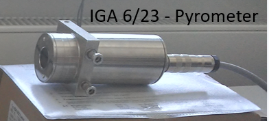
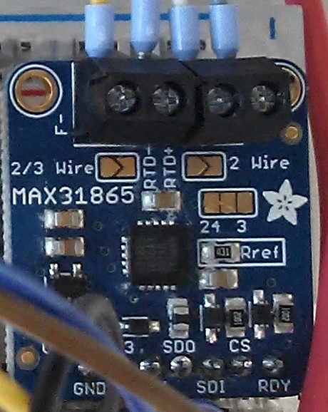
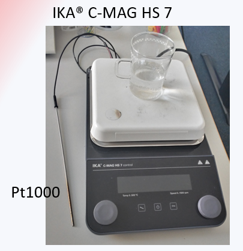
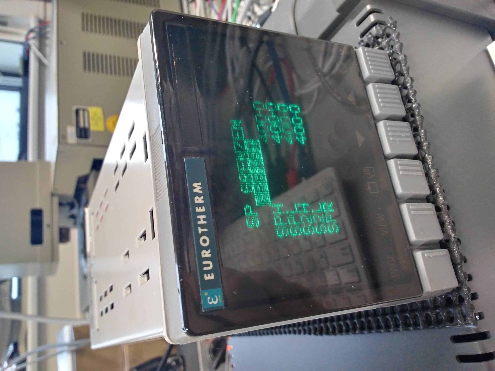

# Emissionsgradmessungen:

Mit diesem Programm sollen in der Test-CZ Anlage verschiedene Emissionsgrade von verschiedenen Materialien gemessen werden. Das Programm baut auf dem des Praktikums auf und wird im Folge meiner Bachelorarbeit optimiert und an neue Anforderungen angepasst. 

---    

## **1. Verwendete Geräte:**

### 1.1. Pyrometer
In dem Experiment sind derzeitig zwei Arten von Pyrometer in Verwendung - Langwellige und Kurzwellige.

Das kurzwellige Pyrometer was in dem Experiment verwendet wird ist ein IGA 6/23 – Laser von der Firma LumaSense. 

Für die langwelligen Pyrometer wird das Impac® Series 600 von Advanced Energy. An dieses werden zwei Pyrometer angeschlossen. Eins hat ein Aspecktverhältnis von 20:1 und das andere von 10:1. 

Für die Pyrometer ist die von mir erstellte Bibliothek "pyrometer.py" zuständig. Die Befehle und ein groß Teil des Programms wurden mir vom IKZ bereit gestellt. 

**Wichtiges zu beachten:**
1. Langwellige Pyrometer:
    - Grenzwerte Pyrometer: 10 % - 120 %    
    In dem Programm wird der Emissionsgrad aber zwischen 100 % und minimal möglicher Wert gehalten.
2. Kurzwellige Pyrometer
    - Grenzwerte Pyrometer: 5 % - 100 % (bei Emissions- und Transmissionsgrad)    
    In dem Programm wird der Emissionsgrad aber zwischen 100 % und minimal möglicher Wert gehalten.
    - misst erst ab einer Temperatur von 74 °C (zeigt unter der Temperatur immer 74 °C an)

### 1.2. Adafruit - Pt100
Die Pt100 werden über Adafruit Module und dem Raspberry Pi 400 mit dem Programm verbunden. 

Diese Pt100 werden in 4-Leiter-Anschluss an den Modulen befestigt. 

Für diese Module ist die von mir geschriebene Bibliothek "adafruit.py" zuständig.

**Wichtiges zu beachten:**
- Durch die spezielle Bibliothek für die Adafruit Module läuft das Programm erst wenn alles richtig installiert wurde. Selbst die Test-Funktion läuft nicht. Das liegt daran das board.py nicht vorhanden ist bzw. das verwendete Board nicht findet. Unter https://github.com/nemocrys/exp-T-control kann man eine Beschreibung finden wie man das Problem löst.    

### 1.3. Heizer
Diese Geräte werden von der von mir geschriebenen Bibliothek "heizer.py" gesteuert. 

In dieser Bibliothek gibt es bisher zwei Heizer - die Heizplatte IKA® C-MAG HS 7 von IKA und der Regler von Eurotherm. Für den Eurotherm wurden bisher die Module 902P und 905S getestet. Nur der 905S hat aber bisher mit uns kommuniziert. 

**Wichtiges zu beachten:**
1. Eurotherm:
    - minimal Temperatur ist 20 °C
2. Heizplatte IKA
    - nach einer vom Geräte Pt1000 gemessenen Temperatur von ca. 360 °C stellt sich das Gerät ab und gibt einen Fehler aus

---

## 2. Zum Programm
Das Programm basiert auf dem erarbeiteten Programm aus meinem Praktikum. So wurden die verschiedenen Funktionen der Bibliotheken der Geräte nun hier in Klassen eingeordnet. Zudem sind Teile aus dem Hauptprogramm übernommen. Auch die GUI die mit tkinter erstellt wird ist hauptsächlich aus dem alten Programm übernommen. 

### 2.1. Programme

1. **hauptprogramm.py:**   
    Im hauptprogramm.py werden die Geräte initialisiert, Grafiken gestartet, Files erzeugt und mit den Messdaten belegt, sowie die Emissionsgradanpassung erzeugt. Zudem werden die Test und Debug Werte an die Gerätebibliotheken gesendet, Eurotherm Heizer bekommt ein Delay und wenn gewollt eine weitere Schnittstelle. Mit dieser Schnittstelle wird ein Arduino als Leistungssteuerung für das Eurotherm initialisiert. Mit dem Arduino Programm in P2 kann man auch den Eurotherm mit dem Arduino ersetzen. 

    *Funktionen:*     
    - **Init_File()**   
    In dieser Funktion werden die drei Files erzeugt und bekommen ihren Kopf.
        - *_temp.txt - Sammlung der Temperaturmesswerte
        - *_Emis.txt - Sammlung der Anpassungsversuche und Abschlüsse (bzw. alle Messwerte der Anpassung stehen hier)
        - *_Emis_End.txt - Sammlung der Angepassten Emissionsgrade
    Zudem wird die Versionsnummer (von GitHub) ausgelesen und der Ordner für die Datein wird erstellt. Die Namen (Ordner und File) richten sich nach dem Datum und werden vom Programm erzeugt. Der Index für den Filenamen wird immer anhand der vorhandenen Filenamen erzeugt und ist fortlaufend von 1.
    - **fenster_GUI()**   
    In dieser Funktion wird die GUI (Schaltoberfläche) für das Programm erzeugt. Wie oben schon erwähnt ist der große Teil aus dem alten Programm. 
    Geblieben ist:
        - Start Knopf
        - Beenden Knopf
        - Manuelle Achsenanpassung für die Temperaturkurven
        - Umschsalt Knöpfe für Manuelles und Automatisches Scaling
        - Graph speichern Knopf
        - Aktualisierung Grapf ein- und ausschalten Knopf
    Die gesamte GUI wird mit Hilfe der Python Bibliothek tkinter erstellt. Mit der Funktion task() wird die Funktion get_Measurment() nach Betätigung des Start-Knopfes immer wieder aufgerufen. 
    - **get_Measurment()**
    Das ist der Kern des Programms in dem die ganzen Messungen durch geführt werden.    
    Folgendes geschieht hier:
        - Messwerte werden geholt
        - Messwert Listen werden erweitert
        - die Vergleischstemperatur wird für die Anpassung bestimmt
        - das Rezept wird bearbeitet    
            1. schauen ob Istwert in Sollwertbereich
            2. Wenn das nicht der Fall ist setzte die Anpassungsvariablen und den Emissionsgrad auf 100 wenn StartConfig = True ist, sonst wird StartConfig nur auf False gesetzt.
            3. Wenn das der Fall ist und StartConfig False ist, so wird der Start des nächsten Loops anhand des Rezeptes berechnet und die Anpassung gestartet. Diese Anpassung wird 16 mal durchgeführt (16 weil "<=15", bedeutet 0 bis 15). Das Prinzip der Anpassung wird später noch näher erklärt.    
            Als nächstes wird geschaut ob der Zyklus abgeschlossen wurde. Wenn ja so wird dem Heizer die nächste Solltemperatur übergeben. Ist der letzte Zyklus erreicht, so wird das Programm folgend beendet und das aktuelle Bild gespeichert. Wenn der Stop Graph Knopf betätigt wurde, so wird die Grafik komplett neu erstellt und gespeichert.
            4. Wenn der Sollwertbereich vorzeitig verlassen wird, dann wird die Anpassung nach Schritt 2 abgebrochen und alles auf 100 zurückgesetzt. und das Programm wartet bis der Bereich wieder erreicht wird.
            5. Die *_Emis.txt und *_Emis_End.txt Datein werden im Laufe der Anpassung gefüllt. 
            
            Notiz:     
            Das * steht für das Datum und den Index der Datei. Der Dateiname wird anhand des Datums erstellt.
        
        - Temperatur Daten werden in File *temp.txt eingetragen
        - Graph wird aktualisiert (Autoscaling und Daten)
    - **Update_Graph(Kurve, Update_Y)**   
    Diese Funktion stammt aus dem alten Programm und updatet die x- und y-Daten des jeweiligen Graphen. Diese Funktion existiert um Redundanz zu vermeiden, jedoch ist sie hier nur noch für die Heizer zuständig. Die Adafruit Module und Pyrometer haben dies in ihrem Objekt mit drin. 
    - **AutoScroll(Graph, AutoStop, xVon, xEnde, yVon, yEnde, minusY, plusY)**   
    Mit dieser Funktion werden die Graphen immer in "Bewegung" gehalten. Wenn das Autoscaling durch Kopf Druck ausgeschaltet wurde, wird hier dem Graphen nur die eingegebenen Werte übermittelt. Ist es eingeschaltet so wird der Maximal und Minimal Wert der y-Achse ermittelt und dann mit dem Zusatzwerten (minusY und plusY) verrechnet. Bei der x-Achse wird immer die selbe Liste verwendet, nämlich die der Zeit. Um den Rand etwas fernzuhalten wird hier ein Zusatz von 10 auf den letzten Wert der Zeitliste hinzugefügt. Den Rest macht das Programm.
    - **Emissions_Anpassung(Temp_Pyro, Temp_Oberf, e_Alt, e_Drauf, o_Grenze, u_Grenze)**     
    In dieser Funktion wird die Anpassung der Emissionsgrade bzw. die Temperaturen werden angepasst und der Emissionsgrad wird lediglich verändert.   
    *Prinzip:*   
    Das Prinzip der Anpassung ist ein Näherungsverfahren, durch ständige Änderung des Emissionsgrad und Vergleich der Temperaturen wird der Emissionsgrad bestimmt.     
    Die Variable "e_Drauf" spielt hier eine große Rolle. Diese Variable wird halbiert wenn die Temperaturen ungleich sind. Der Anfangswert der Variable ist 100. 100 % ist auch die Obergrenze für die Anpassung und wird nicht überschritten! Mit jeder Runde in der Anpassung wird geschaut ob die Temperatur des Pyrmonters größer oder kleiner ist als die Temperatur des Vergleichssensors (am besten Oberflächentemperatur)(ist die Temperatur des Pyrmonters schon zu Beginn größer so bleibt der Emissionsgrad bei 100 %).    
    In jeder Runde wird die Variable "e_drauf" halbiert, das heißt die Variable entwickelt sich wie folgt:   
        - 100 -> 50 -> 25 -> 12,5 -> 6,25 -> 3,125 -> 1,5625 -> 0,78125 -> 0,390625 -> 0,1953125 -> 0,09765625 -> ...   
    
        Besonders zu beachten ist das der Emissionsgrad für die Pyrmonter nur eine Nachkommastelle besitzt. Das heißt mehr als 16 Anpassung sind nutzlos. Nach der 10 Halbierung ist der Wert schon zu klein. Dieser Wert wird nun je Runde von dem alten Emissionsgrad abgezogen oder auf diesen addiert. Durch dieses Prozedere wird sich immer mehr an die Vergleichstemperatur angenähert und wenn sie dann sich überlappen, weiß man den Emissionsgrad des Materials. 
    - **Emis_Update()**    
    In dieser Funktion werden die Emissionsgrad Listen der Pyrometer aktualisiert. Diese Funktion brauch man da diese Aktualisierung an zwei verschiedenen Plätzen vorgenommen werden muss. 
    Notiz:   
    Nach der Anpassung dies nur einmal aufrufen würde nicht klappen, da bei Ende der letzte Wert nicht eingetragen würde!
    - **save()**  
    Diese Funktion dient dem Zwischenspeichern der Grafik.
    - **Start()**     
    Diese Funktion wird durch den Start-Knopf aktiviert und tut folgendes:    
        - Ruft Init_File() auf
        - Startet die IKA Heizplatte wenn ausgewählt
        - Erstellt die Grafik für Temperatur- und Emissionsgradmessung
            - Live-Plot
    - **Stop()**    
    Diese Funktion wird durch den Beenden-Knopf aktiviert oder wenn das Rezept beendet ist. Folgendes wird hier erreicht:   
        - Stoppt die IKA Heizplatte wenn ausgewählt
        - speichert die Grafik die offen ist     
    
    *Sonstiges:*
    1. Parameterliste wird eingelesen
    2. Überprüfung der Eingabe Werte (python Bibliothek argparse genutzt):
        - -test     - Startet Test Funktion
        - -debug    - Startet Debug Funktion   
        - -dt Zahl  - Abtastrate zu Beginn ändern
        - -log      - Erzeugt eine Log Datei mit allen Ereignissen
    3. Test- und Debug-Funktion wird für die Geräte bestimmt
    4. Log-datei wird erstellt wenn -log durch Konsolen Eingabe gestartet wird
    5. Geräte werden initialisiert 
    6. Rezept wird eingelesen
    7. GUi wird gestartet             

2. **config_Parameter.yml**   
Diese Datei wird von Hauptprogramm mithilfe der python Bibliothek yaml ausgelesen. In der Datei befinden sich viele Dictioneries. In dieser Datei stehen die Initialisierungsparameter für die Geräte und weitere Strings (wie der Name der Rezeptdatei und des Regelsensors). Auch die Heizer Auswahl und die Anzahl an Messgeräten kann man über die Datei regeln.

3. **heizer.py**     
In der Datei befinden sich alle Befehle für die beiden derzeitigen Heizer. Die Funktionen für die Heizplatte von IKA stammen aus dem Praktikum. Die Funktionen für den Eurotherm sind neu und werden später noch erläutert. 

    Im laufe der Bearbeitung, auf Grund von Fehlern, wurde eine Emulation für Eurotherm entwickelt. Dieses Arduino Programm kann einerseits das Eurotherm Gerät ersetzen oder andererseits nur die Leistungssteuerung der Heizplatte übernehmen. 

4. **pyrometer.py**    
Im Praktikums Programm waren die kurz- und langwelligen Pyrometer getrennt von einander. In diesem sind die Funktionen nun in einer Datei. Die Funktionen wurden mir vom IKZ gegeben.

5. **adafruit.py**    
Auch die Funktionen stammen aus dem Praktikum. Später wird noch die Quelle bzw. der Ort des Programms genannt. 

    Um die Module initialisieren zu können benötigt man die GPIO Adresse an dem das Modul befestigt ist (Pin am Raspberry Pi). Über die Yaml Datei ist dies in der Weise wie man es brauch (so z.B.: board.D16) nicht übergebbar, da es als String übergeben wird. Die Lösung ist hier ein Dictionarie mit allen Adressen (Pin-belegungen für GPIO). Der Schlüssel wird über die Yaml Datei übergeben und das Programm holt sich den richtigen Wert.

### 2.2. Übernommen aus exp-T-control     
Übernommen wurde:   
1. Hauptprogramm.py (später nur an neue Anforderungen angepasst)
2. die Funktionen für adafruit.py, pyrometer.py und heizer.py (Heizplatte)
3. die GUI (später nur an neue Anforderungen angepasst)

### 2.3. Angepasstes und Neues
Neu in dem Programm ist:    
1. Objektorientierte Programmierung
    - Die Heizer, die Pyrometer und die Adafruit (Pt100) werden alle nun durch Klassen initialisiert, das verbessert das Hauptprogramm sehr. 
    - Die übernommenen Funktionen sind nun Teil einer Klasse.
    - Durch die Klassen ist es leichter das Programm um die Geräte zu erweitern.
2. Parameterliste    
    - Auch diese erleichtert die Erweiterung der Geräte.
    - Alles was an wichtigen und ständig änderten Variablen existiert kann in der Datei angegeben werden und ausgelesen werden.
3. Nur noch Rezept-Modus
    - Im alten Programm konnte man die Rezepte nur mit -cfg name im Konsolenfenster starten, nun übergibt man den Namen des Rezeptes über die Parameterliste.
    - Das neue Programm wurde um alle Manuellen Eingabemöglichkeiten erleichtert, das bedeutet das die Schaltoberfläche (GUI) verringert wird.   
    Raus fliegen tut z.B. die Eingabe des Emissionsgrades und der Sollwerttemperatur, da diese über das Rezept geändert und vorgegeben werden. 
    - Auch der Stop Knopf wurde entfernt, nun gibt es nur noch Start und Beenden.

### 2.4. GUI
Auch die GUI wurde angepasst aus dem vorigen Programm. Viele Teile der GUI wurden entfernt und nur noch Rezept spezifische Befehle sind geblieben. Kurz gesagt alles was eine Manuelle Änderung am Sollwert oder Emissionsgrad vornimmt wurde entfernt.    
Die neue GUI sieht wie folgt aus:    

 

Wenn man die Knöpfe betätigt werden folgende Notizen frei:
 

Die GUI wird durch die python Bibliothek **tkinter** erzeugt. Für diese GUI werden in dem Programm die Positionen Fix vom Programmierer festgelegt. Um die einzelnen Bauteile (Knöpfe, Labels und Eingabefelder) zu positionieren nennt man dem Programm die x- und y-Koordinaten und die Höhe und Breite der Bauteile. 

**ACHTUNG:** Von Betriebssystem zu Betriebssystem kann sich die GUI verändern!

*Was geschieht bei den einzelnen Knöpfen:*
1. AutoScale Ein   
    Diese Knöpfe stellen das Automatische anpassen der x- und y-Achse wieder ein. Nur für das Emissionsgrad Diagramm gibt es das nicht.
2. AutoScale Aus + Ändern    
    Diese Knöpfe verursachen das die Werte der ihnen unterstehenden Eingabefelder eingelesen werden und in der Notiz daneben angezeigt werden. Wenn ein oder alle Felder leer sind wenn der Knopf betätigt ist werden die Default Werte als Skalierung der Achsen eingesetzt und angezeigt. Diese sind bei der x- und y-Achse jeweils von 0 bis 100. 
3. Start   
    Bei drücken dieses Knopfes passiert einiges:   
    1. Erstelle die Files für die Daten
    2. Wenn die IKA Heizplatte ausgewählt wurde, wird diese Gestartet
    3. Erzeuge die Grafik
    4. nStart = True
        - diese Variable ist zu Beginn auf False gesetzt, solange diese False ist wird die Funktion task() überspringen und alle 10 ms prüfen ob sich dies geändert hat, dadurch kann die Messungen solange nicht beginnen, solange Start nicht betätigt wurde
        - die Funktionen save(), Stop() und get_Measurment() können bei nStart = False nichts tun
        - Sobald es auf True steht werden die anderen Funktionen freigeschaltet und die Funktion Start() wird verriegelt
4. Beenden   
    Wenn Start betätigt wurde, dann wird bei Betätigung von Beenden die Funktion Stop() ausgeführt und das Programm danach beendet. Ohne Betätigung von Start wird Stop() übersprungen und das Programm beendet.

5. Bild speichern!   
    Sobald ein Graph da ist kann man mit diesem Knopf Zwischen Bilder speichern.

6. Graph I/O   
    Mit diesem Knopf kann man verursachen das der Live-Plot in get_Measurment() aktualisiert wird. Die Betätigung toggelt eine Variable zwischen False und True. Sobald die Variable auf True steht steht der Live-Plot still, egal was man macht, auch das AutoScale verursacht nichts bis der Knopf erneut gedrückt wird!    
    Eine Notiz unter dem Knopf nennt den aktuellen Status der Variable! 

### 2.5. Grafik:
Auch die Grafik wurde weitesgehend aus dem exp-T-control Projekt übernommen. geändert hat sich aber trotzdem etwas:    
1. Übergabe von Labels/Legenden Namen:   
In dem neuen Programm werden einige Legendenlabels aus der Parameterliste entnommen. Z.B. die Namen für Pyrometer und Pt100. Auch der Regelsensor Name kann in der datei geändert werden. 
2. Zusatzdiagram:    
Je nach dem welcher Heizer angegeben ist, wird eine andere Größe geplottet. Beim Eurotherm/Emulation wird die Ausgangsleistung des Reglers in % geplottet und bei der IKA Heizplatte wird die Heizplattentemperatur ausgelesen. 

**Notiz:**    
Sollten weitere Heizer hinzugefügt werden, so müsste man entweder dieses Diagramm verriegeln oder auch bei dem Heizer eine Größe dort printen lassen. Mit der v3.0 ist dieses Diagramm immer vorhanden. 
 
**Diagramm Eurotherm/Emulation:**    
 

**Diagramm Heizplatte IKA:**  
 
Oben Links:   
Das Diagramm zeigt die Isttemperatur des Regelsensors. Über die Parameterliste kann man das Legenden-Label der Kurve ändern. 

Oben rechts:    
Das Diagramm zeigt die Temperaturmessdaten der Adafruit Module (Pt100 Widerstandsthermometer) und der Pyrometer. Auch hier sind die Label-Namen über die Parameterliste anpassbar.

Unten Links:     
Dieses Diagramm ist das besagte Zusatzdiagramm und zeigt derzeitig entweder die Ausgangsleistung in % oder die Heizplattentemperatur in °C. Die Label-Namen werden je nach Heizerwahl (Parameterliste) fix im Code festgelegt.

Unten Rechts:   
Das Diagramm zeigt die Emissionsgradmessung der Pyrometer. Bis zur Anpassung ist der Emissionsgrad 100 % groß. Die Labels werden durch die Parameterliste angegeben (Name des Gerätes).

Bei dem Diagramm von IKA ist gelichzeitig auch die Test-Funktion dargestellt. Das Programm gibt zufällige Werte zurück.

### 2.6. Weiters 
**Beispiel Programme/Datein:**    
In dem Ordner "Beispiel Datein" liegt ein Beispiel für ein Messrezept und für die YAML Datei. Diese können für das Programm benutzt werden. Für die Nutzung müssen die Datein in den Hauptordner gezogen werden und eventuell wegen der Schnittstelle und eines anderen Rezeptes angepasst werden. 

*Bei dem Namen der Dateien muss dann nur das "Beispiel_" entfernt werden!*

**Rezepte:**   
Ein Rezept besteht aus vielen Zyklen. Jeder Zyklus besteht aus drei Werten - der zu erreichenden Solltemperatur, die Abweichung zu dem Sollwert und wie lange in dem Sollwertbereich sich der Istwert befinden muss.  

*Beispiel:*   
zy1: 50,0.5,20    
* der Istwert soll eine Temperatur von 50 °C erreichen  
* der Sollwertbereich ist von 49,5 - 50,5 °C
* um in den nächsten Zyklus zu springen, bleibe 20 min in dem Sollwertbereich

**Konsolenstart Möglichkeiten**:   
Programm sind auch über eine Konsole (z.B. PowerShell) start bar. Mit der python Bibliothek argparse können mit dem Start eines Programms besondere Ereignisse ermöglicht werden. Folgend werden diese erläutert:   
1. -h, --help
    - damit werden alle möglichen Startextras angezeigt
    - zudem wird das Programm beendet
2. -test   
    - mit diesem Start wird der Test Flag auf True gesetzt, wodurch die Geräte im Testmodus arbeiten und Zufallswerte ausgeben (heißt Programm ist ohne Geräte Testbar - geht aber nur auf dem richtigen "board", da die Adafruit Bibliotheken das Programm abstürzen lassen wenn das Board nicht findbar ist)
3. -debug
    - dies löst den Debug-Modus aus
    - daraufhin werden alle gesendeten Befehle und wichtige Werte im Konsolenfenster ausgegeben
4. -dt DT
    - die Abtastrate bzw. die Zeit der Wiederholung der Messwertbeschaffung kann hier von dem Default Wert 1 s abgeändert werden
    - DT ist der Platzhalter für die neue Zeit (Angabe in ms)
5. -log
    - damit wird der Startschuss gegeben eine Logging Datei zu erstellen und die Ereignisse (die im Programm definiert sind) dort einzutragen

---
## 3. Quellen
### 3.1. Quellen für die Geräte
#### 3.1.1. Eurotherm
Für den Eurotherm Regler wurden verschiedene Manuals genutzt. In diesen Kapitel sollen diese einmal erwähnt werden.    

- Eurotherm 900EPC-BA-HA150789GER.pdf    
    - zu finden im Internet:    
        - https://www.eurotherm.com/download/900-epc-benutzer-handbuch-ha150789ger/
        - https://www.eurotherm.com/download/900-epc-benutzer-handbuch-ha150789ger/?ind=0&filename=900EPC-BA-HA150789GER.pdf&wpdmdl=27254&refresh=61e97823233e71642690595  
    - Sprache: Deutsch    
    - **wichtiger Inhalt**:
        - das Manual bezieht sich auf den hier genannten 905S Eurotherm   
        - S. 17 - Anschluss von Thermoelement und Widerstandsthermometer
        - S. 23 - Anschluss Digitale Kommunikation
            - Notiz:    
            Im inneren des Gerätes gibt es einen Schalter (bzw. Brückenschalter) den man erst auf RS232 oder RS485 stellen muss. Auf den nachfolgenden Bildern kann man es für den 905S sehen.

             

            

            Auf dem folgenden Bild ist der Schalter von dem Eurotherm 902P zu sehen.    

            

    - S. 53 - 54 - AutoTune/Selbstoptiemierung
    - S. 96 - Einstellung der Kommunikationsparameter (Baudrate und Adresse)
    - S. 98 - Einstellung der Sollwertgrenzen
    - S. 116 - Konfiguration und wie man dort hineinkommt
    - S. 166 - Kapitel 7 Kommunikation 
    - S. 172 - 177 - Mnemonik Befehle

- EIBYSINC Beispiel.pdf
    - Dieses Dokument wurde als Antwort an uns von Eurotherm gesendet.
    - Zeigt wie der Code den man an die Schnittstelle senden muss fürs Lesen und Schreiben eines Befehls aussehen muss.
    - zeigt wie der BCC berechnet wird. 

- eurothermCOM.pdf
    - zu finden im Internet: https://www.esrf.fr/computing/bliss/guides/detection/eurotherm/1pdfs/eurothermCOM.pdf 
    - das Dokument bezieht sich auf die 2000 Serie von Eurotherm
    - Hier ist aber auf S. 32 - 33 ein Beispiel zum Lesen und auf S. 34 - 35 ein Beispiel fürs schreiben.

    *Notiz*:    
    Später wird noch erklärt wie die Befehle hier im Programm aussehen!

- 900comms_023776_2_1.pdf   
    - zu finden im Internet: http://www.jjmiller.info/files/BVT3000/900comms_023776_2_1.pdf 
    - S. 26 - EE Bedeutung (Fehlererklärung)
    - S. 29 - 32 - Mnemonik Befehle (die mehr verwendet) (für 902,903 und 904)
    - S. 39 - 44 - Mnemonik Befehle für 900 EPC (905S gehört dazu)

#### 3.1.2. IKA Heizplatte
Die Befehle und Informationen für die Heizplatte kann man auf der nachfolgenden Internetseite finden. Das Dokument zeigt die Betriebsanleitung des Gerätes.   
https://www.ika.com/de/Produkte-Lab-Eq/Magnetruehrer-Heizruehrer-Laborruehrer-Ruehrer-csp-188/C-MAG-HS-7-control-Downloads-cpdl-20002694/

*Dokument:*     
20000031429_DE_C-MAG HS 7 control_112020_web.pdf

#### 3.1.3. Pyrometer
Die Unterlagen für die Pyrometer wurden mir vom IKZ bereitgestellt.     
   
*Dokument Kw:*   
- de-op-iga6-23-manual.pdf
    - S. 33 - 35 Befehle
    - S. 20 - 21 Messfleck und Messfleck-Formel
- https://www.disai.net/wp-content/uploads/catalogos_pdf/MI_en-op-iga6-23-advanced-manual.pdf
    - Englisches Manual   

*Dokument Lw:*    
- Series 600_manual_English.pdf
    - S. 39 - 41 Messfleck
    - S. 26 - 36 Befehle
- https://www.advancedenergy.com/globalassets/resources-root/german/data-sheets/de-op-series600-data-sheet.pdf 
    - S. 2 - einstellbarer Bereich Emissionsgrad

#### 3.1.4. Adafruit
Vom IKZ bekommen:
- adafruit_max31865_rtd_pt100_amplifier-1396508.pdf

Das Dokument bassiert auf folgenden Internetseiten:
- https://learn.adafruit.com/adafruit-max31865-rtd-pt100-amplifier/overview
- https://learn.adafruit.com/adafruit-max31865-rtd-pt100-amplifier/pinouts 
- https://learn.adafruit.com/adafruit-max31865-rtd-pt100-amplifier/assembly 
- https://learn.adafruit.com/adafruit-max31865-rtd-pt100-amplifier/rtd-wiring-config
- https://learn.adafruit.com/adafruit-max31865-rtd-pt100-amplifier/arduino-code 
- https://learn.adafruit.com/adafruit-max31865-rtd-pt100-amplifier/python-circuitpython <*>
- https://learn.adafruit.com/adafruit-max31865-rtd-pt100-amplifier/f-a-q 
- https://learn.adafruit.com/adafruit-max31865-rtd-pt100-amplifier/downloads

<*> Dort steht alles zur Installation und Arbeit mit Python

Die Python Bibliothek ist unter dem Link https://github.com/adafruit/Adafruit_CircuitPython_MAX31865 zu finden. Bei der Installation gab es Probleme, da der Raspberry nicht in der Bibliothek zu finden war. Da das Teil meines Praktikums war, kan man auf der Seite https://github.com/nemocrys/exp-T-control_archive (von mir geschrieben) in Kapitel 5 nachlesen wie das problem behoben wurde. 

### 3.2. Programmquellen
1. Wie man mit tkinter arbeitet:
    - https://pythonbuch.com/gui.html 
2. Erzeugung eines Live-Plotes:
    - https://www.delftstack.com/de/howto/matplotlib/how-to-automate-plot-updates-in-matplotlib/
3. Wie das mit dem logging funktioniert:
    - https://docs.python.org/3/howto/logging.html 
4. Wie man Ordner mit Python erstellt:
    - https://www.delftstack.com/de/howto/python/python-create-directory/ 
5. Autoscalling:
    - https://stackoverflow.com/questions/10984085/automatically-rescale-ylim-and-xlim-in-matplotlib 
    - https://matplotlib.org/stable/api/_as_gen/matplotlib.pyplot.axis.html
    - http://2d.9lo.lublin.pl/DOC/python-matplotlib-doc/html/api/_as_gen/matplotlib.axes.Axes.relim.html 
6. Praktikum:
    - https://github.com/nemocrys/exp-T-control 
    - Bericht_Fachpraktikum_Elektrotechnik_Vincent-Funke_570994.pdf
7. BCC Berechnung:
    - https://www.rapidtables.com/code/text/ascii-table.html 
    - https://stackoverflow.com/questions/3673428/convert-int-to-ascii-and-back-in-python
    - https://learntutorials.net/de/python/topic/730/bitweise-operatoren
    - https://www.delftstack.com/de/howto/python/xor-in-python/
8. Echotest:
    - https://www.arduino.cc/reference/en/language/functions/communication/serial/begin/
---
## 4 . Befehle    

### 4.1. Eurotherm   
Die Kommunikation mit den Eurotherm Geräten erfolgt über die Serielle Schnittstelle. Die Baudrate und die Adresse des Gerätes kann über die Geräte herausgefunden werden. Bisher wurde es nur geschafft den 905P über die Schnittstelle an zusprechen. Dafür musste der in Kapitel 3 gezeigte Brückenschalter umgesteckt werden. Wie man die beiden Werte sowie das Kommunikationsprotokoll findet und einstellt siehe Kapitel 6.1.

Im Dokument "EIBYSINC Beispiel.pdf" kann man sehen wie die Befehle aufgebaut sind und im Dokument "eurothermCOM.pdf" kann man ein Beispiel finden. 

Anders als bei den anderen Geräten brauch man hier Steuerzeichen wie z.B. EOT, STX und ENQ.

Im folgenden wird es hier auch kurz gezeigt und erläutert (vergleiche mit den Quellen für Eurotherm - EIBYSINC Beispiel.pdf und eurothermCOM.pdf (S. 32 - 35))

**Lesebefehl**:   
EOT GID GID UID UID C1 C2 ENQ
- EOT und ENQ - Steuerzeichen 
- GID und UID - bilden die Adresse die man wie oben erklärt finden kann, sie kommen zweimal vor da sie für das Gerät validiert werden müssen     
GID = Gruppennummer   (group number)   
UID = Einheitennummer (unit number)
- C1 und C2 - Mnemonic Befehl (aus den Mnemonic Listen zu entnehmen)

Das EI BISINC arbeitet mit den Mnemonic Befehlen.

Antwort vom Gerät:    
STX C1 C2 D1 D2 D3 D4 D5 ETX BCC
- STX und ETX - Steuerzeichen
- BCC - Prüfsumme
- D1 - D5 - ausgelesener Wert

**Schreibbefehl**:    
EOT GID GID UID UID STX C1 C2 D1 D2 D3 D4 D5 ETX BCC

Antwort vom Gerät:   
NAK oder ACK
- bei ACK ist alles richtig eingegangen
- bei NAK ist ein Fehler aufgetreten

In welchem Format die Werte gesendet werden ist egal, es kann wie im Beispiel eurothermCOM.pdf (S. 32 - 35) komplett in Hex-Format sein oder wie in meinem Programm als Mischmasch aus ASCII und HEX.

**BCC Erklärt**:    
Sowohl beim schrieben und lesen ist der BCC Wert vorhanden. Beim Lesen eines Wertes bekommt man ihn als Antwort als Prüfwert zurück. Beim schreiben muss man diesen berechnen und an das Gerät senden.    
Der BCC Wert wird über das exklusiv Oder kurz XOR berechnet. Jedes Zeichen nach STX bis einschließlich ETX (Schreiben und Lesen) wird dort hinein berechnet.

Das Programm **heizer.py** berechnet in der Klasse Eurotherm den Wert selbst, sowohl beim Schreiben als auch beim Lesen. Im folgenden Beispiel wird kurz alles erklärt gezeigt.

**Beispiel Lesen:**   
Im Programm wird der zu sendende String wie folgt aussehen:   
\x040033PV\x05

Das \x04 steht für EOT und \x05 für ENQ. PV fragt den aktuellen Istwert ab. Durch die Funktion encode aus der serial Bibliothek ist das Übersendungsformat egal, hexadezimale Zahlen müssen nur das "\x" haben. 

Das Gerät könnte folgendes zurückgeben:   
\x02PV1.8\x03"    
(um es anzeigen zu können wurde die Funktion decode kurz auskommentiert, die Steuerzeichen bzw. bestimmte ASCII Symbole können nicht angezeigt werden)    
Am Ende des Strings kann man ein " sehen, dieses Zeichen ist der BCC übersetzt in ein ASCII Zeichen. 

**Berechnung**:   
P XOR V XOR 1 XOR . XOR 8 XOR \x03 = "   
Natürlich muss man alles in das selbe Format übergeben. Um es besser zu zeigen werden die Zeichen in Binär übersetzt! Bei XOR bekommt man immer dann eine 1 wenn die Vergleichspartner nicht gleich sind, heißt:    
0 XOR 0 und 1 XOR 1 = 0, 0 XOR 1 und 1 XOR 0 = 1   

P XOR V =  01010000 XOR 01010110 = 00000110   
00000110 XOR 1 = 00000110 XOR 00110001 = 00110111   
00110111 XOR . = 00110111 XOR 00101110 = 00011001   
00011001 XOR 8 = 00011001 XOR 00111000 = 00100001    
00100001 XOR \x03 = 00100001 XOR 00000011 = 00100010   
00100010 = "  

Wie man sehen kann bestimmt das Programm den Wert richtig.

Zur Berechnung wurde die Tabelle auf der folgenden Internetseite genutzt:  
https://www.rapidtables.com/code/text/ascii-table.html 

**Beispiel Schreiben:**    
Ein Beispiel sieht wie folgt aus:   
\x040033\x02SL120.0\x031
    
Die 1 ist in dem Fall der BCC:    
01010011 XOR    
01001100 =    
00011111 XOR    
00110001 =    
00101110 XOR   
00110010 =   
00011100 XOR    
00110000 =    
00101100 XOR   
00101110 =   
00000010 XOR    
00110000 =     
00110010 XOR    
00000011 =    
00110001 = 31h = 1 (ASCII)   

Die Antwort wird \x06 für ACK und \x15 für NAK sein! 

**Funktion Erklärt**:    
Die Funktion **bcc(self, string)** ist in der Klasse Eurotherm im Programm **heizer.py** für die Berechnung des BCC Wertes zuständig. Der String der der Berechnung übergeben wird besteht nur aus dem Mnemonic Zeichen und beim schreiben auch noch aus der Zahl.

1. Erzeugung einer leeren Liste für die Dezimal Zahlen
    - in der Funktion werden alle Zeichen in Dezimal Zahlen überführt
2. die einzelnen Zeichen des Strings werden umgewandelt
3. am Ende wird eine 3 (\x03 = ETX = 3 (Dec)) an die Liste gehangen die das Streuerzeichen ETX symbolisiert
4. die Variable bcc wird auf 0 gesetzt (etwas XOR 0 bleibt das selbe)
5. die einzelnen Listen Elemente (einzelnen Zeichen) werden über das XOR Schritt für Schritt verrechnet (wie im Beispiel Schreiben)
6. der berechnete BCC wird als ASCII an den Sende Befehl übermittelt

**Genutzte Befehle (Mnemonic):**
1. Werte Lesen:
<pre>
    * Identifikation        -->     II
    * Fehlermeldung         -->     EE 
    * Isttemperatur         -->     PV
    * Solltemperatur        -->     SL 
    * Software Version      -->     V0      
    * Sollwertgrenze Max    -->     HS      
    * Sollwertgrenze Min    -->     LS  
    * Istwertgrenze Max     -->     1H
    * Istwertgrenze Min     -->     1L    
    * Ausgangsleistung      -->     OP 
    PID-Parameter:     
    * Proportional Band     -->     XP     
    * Integral Zeit         -->     TI      
    * Ableitungszeit        -->     TD
</pre>
2. Werte Schreiben:
<pre>
    * Solltemperatur        -->     SL 
    PID-Parameter:  
    * Proportional Band     -->     XP     
    * Integral Zeit         -->     TI      
    * Ableitungszeit        -->     TD                   
</pre>  

Bei 1H und 1L muss man den Befehl wie folgt senden: 11H und 11L. So werden diese Werte für den Regelkreis 1 ausgelesen (diese Befehle sind auch Read Only). 

### 4.2. Heizplatte IKA

Wie bei dem Eurotherm Gerät wird die Schnittstelle über die python Bibliothek serial eingestellt und somit die Kommunikation über RS232 bereitgemacht. 

Als Quelle dient hier das Readme (deutsch) aus dem Praktikumsprogramm von Seite https://github.com/nemocrys/exp-T-control.   

Zu dem kann dies im Manual, zu finden auf der Internetseite https://www.ika.com/de/Produkte-Lab-Eq/Magnetruehrer-Heizruehrer-Laborruehrer-Ruehrer-csp-188/C-MAG-HS-7-control-Downloads-cpdl-20002694/ nachgelesen werden. 

Um die Befehle richtig senden zu können benötigt man hier im Anschluss des Befehls ein \r\n, was auch bei den Funktionen schon dargestellt ist.  
        
1. Werte vom Gerät Erfragen:        
<pre>
    * Gerätenamen                       -->     IN_NAME\r\n
    * Isttemperatur (Externer Fühler)   -->     IN_PV_1\r\n 
    * Isttemperatur (Heizplatte)        -->     IN_PV_2\r\n
    * Solltemperatur                    -->     IN_SP_1\r\n 
    * Sicherheitstemperatur             -->     IN_SP_3\r\n
</pre>
2. Werte am Gerät ändern oder an das Gerät übergeben:
<pre>
    * Solltemperatur                    -->     OUT_SP_1 x\r\n                      
        Integer --> Bereich: x = 0 ... 500 °C       (Eingabe ohne Einheit)
    * Stoppe die Heizung                -->     STOP_1\r\n
    * Starte die Heizung                -->     START_1\r\n
</pre>     

### 4.3. Pyrometer
Auch die Pyrometer werden über eine RS232 Schnittstelle angesteuert. Der Unterschied zwischen den Langwelligen und Kurzwelligen Pyrometer ist, dass das langwellige Pyrometer nur eine Schnittstelle brauch und mehrere Pyrometer über eine Nummer steuert. 
#### 4.3.1. Kurzwellige Pyrometer
Die Befehle sind alle in dem Manual (siehe Quellen) zu finden. Alle Befehle brauchen am Ende ein \r um gesendet zu werden.  

Als Antwort bei einem Befehl sendet das Gerät ein ok zurück, sollte ein no zurück kommen, dann war das Senden oder bearbeiten des Befehls nicht erfolgreich. 
1. Auslese Befehle:
<pre>
    * ID                    -->     00na
    * Fokus                 -->     00df
    * Emissionsgrad         -->     00em
    * Transmissionsgrad     -->     00et
    * Erfassungszeit        -->     00ez
    * Istwert               -->     00ms
    * Laser An              -->     00la1
    * Laser Aus             -->     00la0
</pre>
2. Eingabe Befehle (Beispiel):
<pre>
    * Emissionsgrad         -->     00em1000
        - Der gesendete Wert besteht aus 4 Zahlen, wodurch die letzte Zahl 
        die erste Nachkommastelle ist (auch beim Lesen bekommt man die Zahl 
        so zurück, das Komma muss von Hand (Computer) eingetragen werden)
        - Der Zahlenstring muss aber nicht aus 4 Zeichen bestehen!
        - hier würde 100 % übergeben werden 
        - Möglich nur von 5 % - 100 %
    * Transmissionsgrad     -->     00et0105
        - hier würde 10,5 % übergeben werden 
        - Möglich nur von 5 % - 100 %
    * Erfassungszeit        -->     00ez7
        - die Möglichen Zahlen stehen im Manual (siehe 3.1.3.) S.34 (PDF) 
        und im Englischen auf S. 36 (Internet).
</pre>

#### 4.3.2. Langwellige Pyrometer
Auch hier sind die Befehle in den Manuals zu finden (siehe Quellen). Ein großer Unterschied zu dem Kurzwelligen ist, dass die Befehle eine Nummer (Adresse) brauchen. Auch diese befehle enden mit einem \r.

Die Nummer für die Pyrometer Erkennung beginnt mit 1. Diese Nummer wird im folgenden immer mit 1 gezeigt und wird im Manual (PDF) als "head address" (S. 26) bezeichnet.

Die "00" ist die Adresse der "converter box" (Manual (PDF) S. 26)

1. Auslese Befehle:
<pre>
    * ID                                        -->     00A1sn
    * Anzahl der angeschlossenen Pyrometer      -->     00oc
    * Emissionsgrad                             -->     00A1em
    * Erfassungszeit                            -->     00A1ez
    * Istwert                                   -->     00A1ms
</pre>
2. Eingabe Befehle (Beispiel):
<pre>
    * Emissionsgrad         -->     00A1em1000
        - Angabe des Wertes wie bei bei den Kurzwelligen 
        - Der Zahlenstring muss aber nicht aus 4 Zeichen bestehen!
        - hier würde 100 % übergeben werden 
        - Möglich nur von 10 % - 120 %
    * Erfassungszeit        -->     00A1ez6
        - die Möglichen Zahlen stehen im Manual (PDF) S. 29
</pre>

### 4.4. Adafruit Modul (Pt100)
Diese Module haben keine Befehle, das Modul wird nur ausgelesen mit Hilfe der heruntergeladenen python Bibliothek (siehe 3.1.4.). Die Funktion "temperatur" sorgt dafür, dass das Modul ausgelesen wird. 

## 5. Mögliche Fehler der Geräte + Fehlermeldungen vom Gerät
Im Laufe meines Praktikums sind verschiedene Fehler aufgetreten. Ein Grund für die nicht Antwort der Geräte könnte die schiere masse an Befehlen gewesen sein die das Gerät überfordert hat. Bisher haben nur die IKA Heizplatte und die Langwelligen Pyrometer fehlerhafte Werte zurückgegeben. Die erste Lösung war die Werte anzufangen und das Programm danach nicht vollständig auszuführen, die neue Idee ist es den Fehler abzufangen und die Sendung des Befehls zu wiederholen. 

Bei dem Eurotherm Gerät kann man den Fehler mithilfe von dem Mnemonic **EE** abfragen. 

### 5.1. Eurotherm:
Mit dem Mnemonic Befehl **EE** kann man den Fehler des vohergehenden Befehls auslesen. Im folgenden werden die bisher aufgetretenen Fehler ein mal Beschrieben. 

***Fehler EE =***   
1. 00    
Diese Meldung heißt das es kein Problem mit dem Befehl gab.
2. 02    
Dieser Fehler zeigt an das es einen BCC Error gibt. Das bedeutet, dass der BCC Wert den man beim senden geschickt hat falsch ist.
3. 08   
Damit wird ein Limit Error angegeben. Bei der Sollwerttemperatur bedeutet es das die beiden Sollwertgrenzen nicht richtig eingestellt sind. Diese sind nur über das Gerät auslesbar mit den Befehlen **HS** (max. Sollwert) und **LS** (min. Sollwert). Wie man die Grenzen ändern kann siehe Kapitel 6.1.
4. 1F    
Der Fehlercode sagt das bei dem Befehl der zweite UID Wert nicht stimmt. Der UID Wert wird wegen Validierungs Zwecken zweimal gesendet. 
5. 01     
Dieser Fehler gibt an das der Mnemonic Befehl ist Invalid.
6. 04     
Der Fehler bedeutet das der Befehl "Read Only" ist.    
7. 22    
Dies sagt das der parameter der gelesen werden soll noch nicht eingesetllt/konfiguriert ist.

Die Fehlermeldungen kann man auf der S. 26 des Dokumentes "900comms_023776_2_1.pdf" nach lesen (unter 3.1.1.) kann man auch die Internetseite finden von dem das PDF stammt.

**Fehler beim Schreiben:**   
Wenn ein NAK vom Gerät als Antwort kommt, so liegt ein Fehler vor. Wie schon erfähnt kann man den mit EE herausfinden.

**Fehler beim Lesen:**   
Beim Lesen muss man selbstständig überprüfen ob die Antwort richtig ist. Hierfür sendet das Gerät selber einen BCC Wert zurück, denn der Nutzer dann überprüfen kann. Der BCC wird wie beim Schreiben eines Wertes berechnet, alles nach STX bis einschließlich ETX. Das Programm heizer.py berechnet auch den BCC von der Antwort und vergleicht den Wert mit dem gesendeten BCC Wert des Gerätes.

### 5.2. Pyrometer
Bisher wurde nur vom langwelligen Pyrometer ein **no** zurückgesendet. Das wiederholen des sendens des Befehls half. Die Endlosschleife bringt nichts wenn der Emissionsgrad unter die Minimalgrenze fällt. Bei LW ist diese 10 % und bei KW 5 %, das selbe dann auch für die Maximale Grenze, im Programm soll der Wert nicht über 100 % gehen (LW kann bis zu 120 %).

### 5.3. Heizplatte IKA
Auch die Heizplatte macht Probleme. Sowohl das angeschlossene Widerstandsthermometer als auch der interne Heizplattensensor senden von Zeit zu Zeit Leere Strings oder eine Null zurück. Der Grund dafür könnte sein das das Gerät nicht schnell genug reagieren kann. Die Schleife zum erneut senden soll dies bessern (kein Test bisher).

Zum anderen stürzt die Platte ab wenn man den externen Sensor entfernt und wenn der Istwert eine Temperatur von ca. 360 °C erreicht. Das letztere ist aber eine Funktion der Platte zum Schutz des Sensors und kann im Datenblatt nachgewiesen werden. Dies ist einer der Gründe warum das Experiment nun über den Eurotherm und der Test-CZ Anlage durchgeführt werden soll.  

---

## 6. Einstellungen

### 6.1. Eurotherm 905S
Mit der "PAGE" Taste (links außen) steuert man durch die Bildschirme des Gerätes und kann aus einem Untermenü ins überlegende Menü wechseln. Mit der "VIEW" Taste (zweite von links) springt man in die Untermenüs. Mit den Pfeiltasten (zweite und dritte von rechts) kann man die Werte ändern. Mit der ganz rechten Taste kann man in den Menüs scrollen, ein Angewähltes Menü leuchtet Grün. 

Die Ortsangaben beziehen sich auf die folgenden Bilder.

*Einstellung für die Sollwertgrenzen wie folgt:*   
1. mit der "PAGE" Taste auf Seite "ZUGRIFF AUF"  
   

2. "EBEBNE 3" auswählen und "VIEW" drücken                
3. "SOLLWERT" mit "VIEW" auswählen        

4. "SP GRENZEN" mit "VIEW" auswählen  

5. "SPH" und "SPL" auswählen und mit den Pfeiltasten ändern       
       

*Einstellung der Baudrate und Adresse für die Kommunikation:*
1. Gerät starten
2. Page "Zugriff AUF" auswählen    
 

3. "EBENE 3" auswählen  

4. "Kommunikation" auswählen  
   

5. Baudrate und Adresse einstellbar mit Pfeiltasten   
 

*Auch das Kommunikationsprotokoll muss eingestellt werden:*   
1. Konfiguration (Einschalten + PAGE und VIEW Taste drücken)   
2. "Anwendung" auswählen   
   

3. "Schnittstelle" auswählen   
 

4. "Komm Typ" auswählen (über Master Config)    

5. Wir nutzen das Protokoll: **EI BISYNC**    
    

Der Istwert kann über verschiedene Sensoren bestimmt werden. In diesen Experiment sind Thermoelemente und Widerstandsthermometer die Sensoren der Wahl. Um diese aber nutzen zu können muss man sie richtig anschließen und richtig konfigurieren. Wie die Sensoren anzuschließen sind kann man in dem Manual "Eurotherm 900EPC-BA-HA150789GER.pdf" auf S. 17 (siehe dazu auch Quellen - Kapitel 3) nach lesen. Wie diese Konfiguriert werden kann man folgend sehen:    

*Sensor auswählen:*
1. Konfiguration (Einschalten + PAGE und VIEW Taste drücken)   
2. "Instrument" auswählen   

3. "Prozess Eing" auswählen   

4. "Linearisierung" auswählen   

5. den Sensor der angestöpselt ist auswählen (RT100 = Pt100 - Widerstandsthermometer und wir nutzen K T/C - Thermoelement von Typ K)    

Als die Sensoren getauscht wurden, wurde plötzlich der Fehler Fühlerbruch angezeigt. Bei näheren durch suchen der Konfiguration und Einstellung in "Ebene 3" wurde klar das die Sollwertgrenzen alle auf 400 °C gestellt wurde und der Wertebereich des Sensors stannt auf 750 °C bei Maximal und Minimal. Nach der Ändrung des Minimal Wertes konnte man die Sollwertgrenzen ändern und es wurde auch ein plausibler Wert ausgegeben.

*Wertebereich einstellen:*
1. führe die Schritte 1 - 3 von *Sensor auswählen* durch
2. "Wertebereich" auswählen     

3. Max und Min Wert ändern   

Bei den Thermoelementen ist es noch wichtig das die richtige Vergleichsstelle eingestellt ist, dies geht wie folgt:
1. Konfiguration (Einschalten + PAGE und VIEW Taste drücken)   
2. "Anwendung" auswählen   
  

3. "Eingaenge" auswählen   
 

3. "Vergl Stelle" auswählen   
 

4. "Intern" auswählen     
 

### 6.2. Heizplatte IKA
Bei der Heizplatte gibt es zwei wichtige Dinge die man nicht über ein Programm ändern kann.    
(Quelle: Readme (deutsch) von https://github.com/nemocrys/exp-T-control)

Die erste sache ist wie man die **Sicherheitstemperatur einstellt**.   
Dies geht wie folgt:         
1. links vom Ein-Aus-Schalter gibt es ein kleines Loch
2. mit einem Schraubenzieher geht man in das Loch und dreht die darin liegende Schraube
3.  einstellbarer Bereich:  100 °C ... 650 °C   
    - die Solltemperatur richtet sich nach dieser Sicherheitstemperatur und kann bei bestimmten Sicherheitstemperaturen nur bedingt groß sein      
            
Die zweite Sache ist die Auswahl des **Reglers**. Zur Auswahl steht der PID und der 2P (Zweipunktregler).     
Die Einstellung geht wie folgt:              
1. die Einstellung geht nur wenn kein Programm vom Pc läüft (Schnittstelle nicht in Nutzung)
2. Betätige die Taste mit dem Schraubenschlüssel
3. mit dem rechten Drehknopf solange drehen bis PID oder 2P auf dem Bildschirm blinckt 
4. zu Bestätigung einmal den Drehknopf drücken         
5. nun den Drehknopf solange drehen bis der gewünschte Regler erscheint        
6. nach der Auswahl, Drehknopf einmal drücken und zum Verlassen des Menüs die taste mit dem Schraubenschlüssel betätigen     
