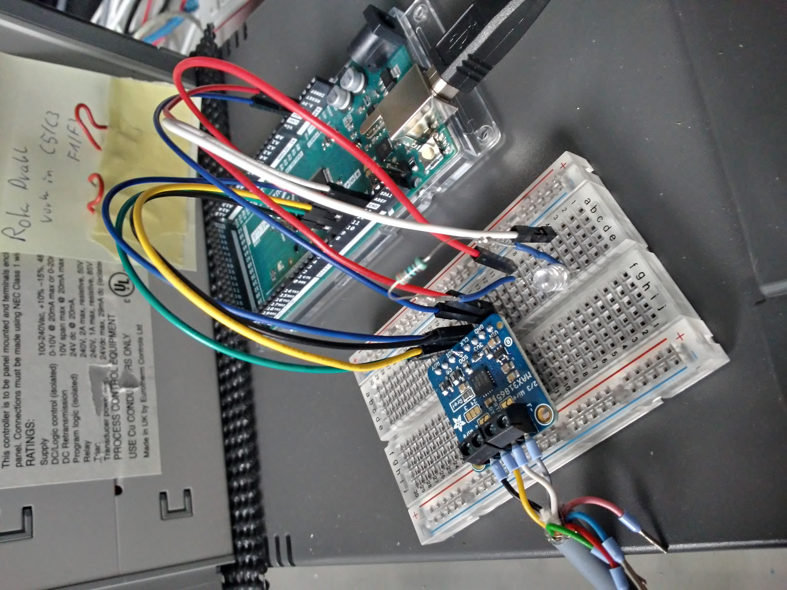
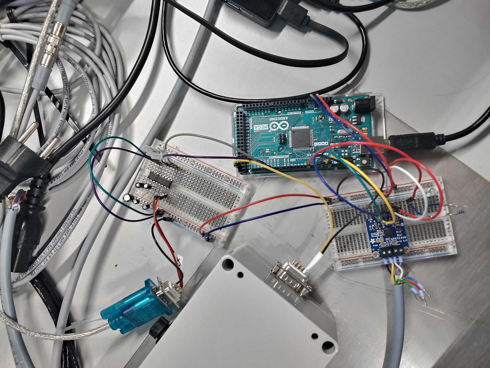
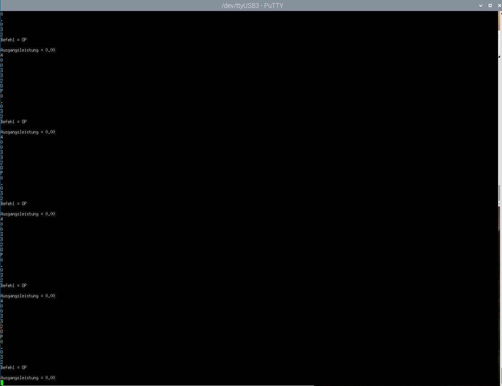

# Emulation eines Eurotherm Gerätes mit Arduino

## 1. Allgemeines

In dem Teil soll ein Eurotherm Gerät nachgestellt werden. Das Gerät wird mit einem Arduino Mega ersetzt. Über ein Adafruit Modul wird ein Pt100 ausgelesen (wie bei dem Programm für die Emisionsgradbestimmung und Raspberry Pi). Diese Maßnahme ist notwendig, weil die drei bisher genutzten Eurotherm Geräte (902P, 2x 905S) immer Macken aufweisen oder die richtigen Einstellungen nicht gefunden wurden.  

1. Schnittstelle nicht funktioniert
2. Temperaturanzeige nicht richtig
3. Ausgang liefert 24 V und nicht wie gehofft 0 - 10 V

Aus den Gründen wird nun mit Arudino und C++ eine Nachbildung gebaut die dann das Gerät ersetzt, aber mit dem Programm **hauptprogramm.py** (im anderen Ordner zu finden) arbeitet.

Den größten Teil der Emulation wurde mir vom IKZ bereitgestellt. Dies wurde von Dr. Kaspars Dadzis geschrieben bzw. bereitgestellt.

Folgende Dateien wurden bereitgestellt:    
1. Adafruit_MAX31865.cpp    
2. Adafruit_MAX31865.h
3. PID_v2.cpp
4. PID_v2.h
5. TimerOne.cpp 
6. TimerOne.h
7. known_16bit_timers.h
8. arduino_test_eurotherm.ino

Meine Aufgabe ist es in der **Datei 8** die Befehle der Bibliothek **heizer.py** einzuarbeiten. Dadurch soll der Arduino ähnlich wie der Eurotherm arbeiten.  

Das von mir hinzugefügte in der Datei "arduino_test_eurotherm.ino" wird mit folgenden Strings gekennzeichnet:
// - Vincent Funke - 1.2.22 - Beginn & // - Vincent Funke - 1.2.22 - End

## 2. Quellen
  
1. https://myhomethings.eu/en/arduino-string-objects/ 
    - Bearbeitung von Strings in Arduino
2. https://www.youtube.com/watch?v=X5u2qCzcPn8 
    - Arbeiten mit Strings 
    - Auch für das Dokument genutzt: **Gruppenarbeit_Bau_einer_Linearverfahreinheit_Gruppe-4.pdf**
3. https://www.arduino.cc/reference/de/language/structure/bitwise-operators/bitwisexor/ 
    - XOR Nutzung
4. https://www.delftstack.com/de/howto/arduino/arduino-convert-float-to-string/
    - Umwandlung von Float in String
5. https://www.heise.de/make/artikel/Arduino-Bibliotheken-einbinden-und-verwalten-3643786.html
    - Wie man Bibliotheken umgeht!
6. https://www.arduino.cc/reference/de/language/variables/data-types/stringobject/ 
    - String Funktionen 
    - c_str() für Serielles Schreiben
7. https://forum.arduino.cc/t/read-line-from-serial/98251/4 
    - String Zeile einlesen
8. https://forum.arduino.cc/t/eingelesenen-sring-richtig-identifizieren/246163/6
9. https://www.arduino.cc/reference/de/language/structure/control-structure/switchcase/
    - switch case Anleitung für Arduino
10. https://forum.arduino.cc/t/serial-print-mit-zusatzlichen-steuerzeichen/224029/3 
    - STX besser übergeben!
11. https://elextutorial.com/learn-arduino/arduino-led-blink-digital-output-digitalwrite-pinmode-code/ 
    - LED Nutzung
12. https://www.arduino.cc/reference/de/language/functions/communication/serial/available/
    - Erklärung zu Serial.available()
13. https://www.rapidtables.com/code/text/ascii-table.html
    - ASCII Tabelle
14. https://www.arduino.cc/reference/de/language/structure/boolean-operators/logicalor/
    - Logisches Oder richtig benutzen 

## 3. Meine Programm Zeilen erklärt
In der Datei "arduino_test_eurotherm.ino" habe ich Erweiterungen des existierenden Codes getätigt. Wie oben beschrieben ist dieser auch kennzeichnet. 
Die Aufgabe war es das Eurotherm Gerät was vorher genutzt wurde nachzubilden. Um dies zu schaffen sollten die Befehle vom Eurotherm mit der Emulation funktionieren. Bei einigen Befehlen gibt es ein zwei Einschränkungen. 

Aussehen der Befehle:
<pre>
Lesebefehle:
EOT UID UID GID GID Befehl ENQ - ans Gerät
STX Befehl Wert ETX BCC        - Antwort vom Gerät

Schreibbefehl:
EOT UID UID GID GID STX Befehl Wert ETX BCC  - ans Gerät
NAK oder ACK                                 - Antwort vom Gerät
</pre>

In dem Programm wurde von mir im Loop die Bearbeitung des Befehls eingefügt und zwei Funktionen für die Antwort des Gerätes. 

### 3.1. Funktion des Codes
1. **Befehl auslesen und bearbeiten:**    
Wie man in den Befehlen sehen kann, sind die Endungen und Längen der Befehle für Schreiben und Lesen unterschiedlich. Zudem sind Steuerzeichen in den Befehlen beinhaltet.      
Für die Bearbeitung des Befehls sind verschiedene Boolesche variablen zuständig:
    1. einlesen:     
    Mit ***einlesen*** wird geschaut ob das Letzte Steuerzeichen gefunden wurde und das nachfolgende Zeichen nicht mehr eingelesen werden. Die Steuerzeichen sind fürs Lesen - ENQ und fürs Schreiben - ETX.      
    Sobald diese Zeichen gefunden wurden wird einlesen auf **False** gesetzt. Beim Schreibbefehl wird dann wenn der BCC Wert gelesen wird die Ausgabe bearbeitet und der BCC Wert unbeachtet gelassen. Beim Lesen ist das nicht der Fall. Ein großes Problem war das die erste Antwort des Gerätes nicht die richtige war und somit die folgenden Antworten falsch waren. Dies lag daran das ENQ das letzte Zeichen in dem Lesebefehl war und Serial.available() nichts mehr zurückgibt  bzw. nichts mehr zum einlesen hatte! Die folgende Variable behebt das. 
    2. befehl_fertig:      
    Mit ***befehl_fertig*** wird verhindert das nach ENQ die Logik zum Ausgeben der Antwort übersprungen wird. Nach dem das ENQ gefunden wurde, wird bei den Lesebefehlen noch eine Runde in der if-Anweisung gedreht und somit die Funktion Eurotherm ausgelöst.     
    3. lesen:      
    Sobald ***lesen*** auf **True** gesetzt wird, ist ein Lesebefehl vollständig eingegangen (Wahrscheinlich könnte man befehl_fertig und lesen verbinden und somit eine Variable Sparren). Dies geschieht bei ENQ auftreten. Diese Variable löst dann in der Eurotherm Funktion die Bearbeitung der Antwort eines Lesebefehls aus.      
    4. schreiben:
    Diese Variable funktioniert genauso wie die Variable **lesen**. Mit ***schreiben*** wird später die Antwort für den Schreibbefehl bearbeitet. Das setzen der Variable auf **True** kann entweder bei STX oder ETX stattfinden, da diese Zeichen nur in dem Sendebefehls für Schreiben auffindbar sind.       

    Nach der Bearbeitung des Befehls werden die Booleschen Variablen auf ihre vorherigen Zustände zurückgesetzt. 

    Die Bearbeitung der Befehle funktioniert mit einem **switch case**. Solange die Schnittstelle bereitsteht und der Rückgabe Wert von Serial.available() größer Null ist, wird ein Zeichen aus dem seriellen Puffer ausgelesen. Dieses Auslesen erfolgt mit **Serial.read()**. Solange **einlesen** True ist wird das switch case durchgeführt. In dem switch case wird nun nach bestimmten Zeichen geschaut. Wenn z.B. ein Steuerzeichen auftritt wird dieses Ignoriert oder und eine Boolesche Variable wird gesetzt. Sobald eine Zahl oder einer der Befehlsbuchstaben gefunden wird, wird dieses an den String in **eingabe** gehangen.      
    In jedem Loop nach switch case werden bestimmte Strings verglichen. So wird z.B. wenn der String "0033" (Adresse - UID UID GID GID - nur Adresse 3 hier vorhanden) gefunden wird **eingabe** geleert. wenn z.B. der code "PV" gefunden wird, so wird die Variable **code** "PV" erhalten und **eingabe** geleert. Zum Schluss steht nur noch der Wert eines Schreibbefehls in der Variable **eingabe**, da alle Steuerzeichen ignoriert und alle nachfolgenden Zeichen nicht mehr kontrolliert werden. 

    Zusätzlich wurden bei ETX und ENQ sowie nach der Eurotherm Funktion, LEDs eingearbeitet. Somit wird die LED je Befehl zwei mal blinken.            
     
2. **Antwort erstellen:**    
Die Antwort eines Befehls wird in der Eurotherm Funktion erstellt. Die Eurotherm Funktion erhält aus dem Loop den Code (Mnemonic-Befehl), den Wert (nur schreiben) und ob Lesen oder Schreiben aktiv ist. 

    In der Funktion wird als erstes festgestellt ob es nun eine Antwort für das Lesen oder Schreiben erstellen soll. Danach überprüft das Programm welchen Wert auslesen und zurückgeben muss oder welchen Wert er ändern soll.     
    Beim Lesen werden bestimmte Variablen wie Sollwert, PID-Parameter und Isttemperatur von dem Regelsensor ausgelesen.     
    Beim Schreiben wird der Wert von einem String in einen Float oder Integer umgewandelt und der Variable übergeben. 

    Bei dem Lesebefehlen muss man nun den BCC Wert beachten, da diese von dem Hauptprogramm bzw. heizer.py (Emissivitätsprogram) kontrolliert wird. Dazu wird bei jedem Lesebefehl die Funktion BCC ausgelöst. Diese Funktion berechnet einen Charakter aus ASCII Zeichen. Diese    Berechnung erfolgt mit dem XOR was in der Programmierung durch das "^" gekennzeichnet wird. In der Funktion wird zunächst die Länge von Code und Wert bestimmt, weil diese unterschiedlich lang sind. daraufhin wird in einer For-Schleife jedes Zeichen als Zeichen (Charakter) ausgelesen und in den BCC berechnet. Zum Schluss wird eine 3 hinzugerechnet, welche das ETX kennzeichnet. Weiteres kann man im Readme des anderen Programmes (Emissivität) nachlesen.  

3. **Einsparrungen:**
    - Die Antwort für das schreiben ist immer ACK!
    - Der BCC vom eingehenden Befehl wird ignoriert.
    - II, EE, V0, 11H, 11L, HS, LS - geben Feste Werte zurück
    - EE sagt immer das es keine Fehler gibt

4. **Test-Funktionen:**
    - **LED:**   
    Wie schon erwähnt gibt es in dem Code LED Funktionen. Die LED wurde an den PIN 7 des Arduinos gesteckt. Die LED ist so programmiert, dass sie bei jedem Befehl zwei mal blinkt.         
    
                        
    
        Als Widerstand wurde ein 330 Ohm Widerstand verwendet. 

    - **zweite Schnittstelle:**    
    Dr. Kaspars Dadzis hat eine zweite Schnittstelle entworfen die man auf dem folgenden Bild sehen kann: 

          

        Die Schnittstelle kann man mit Serial1 oder Serial2 (je nach Pin-Belegung von TX und RX) aufgerufen. Durch diese Erweiterung kann man das Programm debugen, indem man die Variablen auf diese Schnittstelle ausgeben lässt. Würde man mit nur Serial arbeiten, würde man sich Dinge in seine Antworten schreiben.

         

        Im Putty werden verschiedene Sachen ausgegeben. Auf dem Bild kann man ein Beispiel sehen, die Ausgaben sind aber noch mehr geworden und werden im folgenden Kurz aufgezählt.

        - Eingelesene Zeichen (siehe Bild)   
        - Eingelesener Code (Mnemonik - siehe Bild)
        - bei Sollwertänderung - vorheriger und neuer Sollwert (nur bei Emulation)
        - Ausgangsleistung (siehe Bild)
        - Maximale Ausgangsleistung
        - Variablen: PIDOutputDACvolts, PIDOutputDACbits, PIDOutputDACvoltsCheck & DDPIDLimitMaxDAC

5. **Variante 3:**   
In Variante 3 wird "myPID.SetMode(AUTOMATIC)" auf MANUAL umgestellt. Der Arduino bekommt nun vom Eurotherm Gerät den Wert vom Mnemonic Befehl "OP" und rechnet ihn um bevor er diesen in die Variable "PIDOutput" setzt.    
Dieser Befehl wird nur aufgerufen wenn im hauptprogramm.py der gegebene Wert aus der Parameterliste gefunden wird und auch auf True steht, sonst wird der Teil einfach übersprungen. In heizer.py wird alles dann dazu bearbeitet, immer wenn OP aus dem Eurotherm gelesen wird, wird kurz darauf zum Arduino gesendet und bearbeitet. Diese Bearbeitung ist dann auch in Serial2 sichtbar.  

