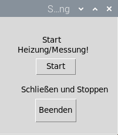
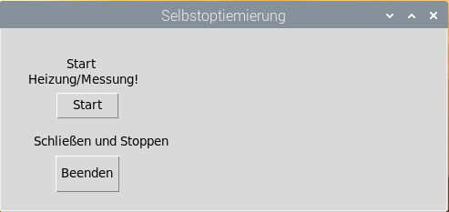
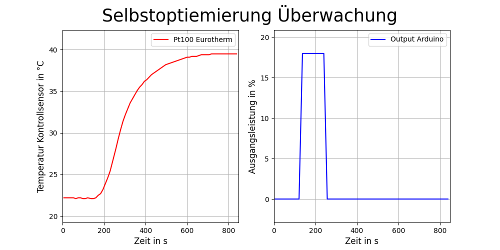

# Programm für AutoTune/Selbstoptimierung
Das Program "Autotune_Testprogram.py" wurde aus dem Programm hauptprogram.py und heizer.py erstellt. Anders als das Programm besitzt dieses hier nur eine sehr kleine GUI mit Beenden und Start. Hier werden keine Graphen automatisch gespeichert noch Textdatein erstellt. Mit der Grafik soll nur eine Überwachung der gerade nebenbei laufenden Messung stattfinden. 

Um genau zu sein wurde das Programm für die Überwachung des AutoTunes genutzt. Das Programm liest die Leistungswerte von Arduino und Eurotherm aus und sendet den Leistungswert von Eurotherm an den Arduino. Das Programm kann zu dem den Temperaturwert aus Eurotherm auslesen. 

Übernommen aus:
1. hauptprogramm.py
    - fenster_GUI()
    - get_Measurment()
    - Update_Graph(Kurve, Update_Y)
    - AutoScroll(Graph, minusY, plusY)
    - Start()
    - Stop()
2. heizer,py
    - bcc(string)
    - send(write_befehl)
    - read(read_befehl, schnitt, delay)

Die verschiedenen Funktionen wurden aus den besagten Programmen kopiert und dann an die neuen Anforderungen angepasst. Z.B. unter "fenster_GUI()" sind alle anderen Funktionen die nicht mit Start und Beenden zutun haben entfernt. Die Funktionen wurden stark vereinfacht.

Das Programm dient der Variante 3 (Eurotherm und Arduino) und soll somit die Selbstoptimierung möglich machen. Die Schnittstellen müssen per Hand im Programm eingegeben werden.

Das Programm kann aber auch für andere Überwachungen oder Test genutzt werden.  

Am Ende des Programmes werden 5 Werte vom Eurotherm erfragt:
- XP (P-Glied)
- TI (I-Glied)
- TD (D-Glied)
- Cutback (Max und Min)

Über die Variable "Ardu_on" kann man zwischen der Variante 1 und 3 wechseln. Wenn die Variable auf True steht, so arbeitet das Programm mit dem Arduino, wenn es auf False steht wird nur der Eurotherm beachtet!

## GUI:

## Graph:

Auf dem Bild ist auch ein AutoTune des Eurotherms zu sehen. Mit den späteren Änderungen der Emulation ist der Unterschied zwischen Output Eurotherm und Output Arduino verschwunden, sie sind nun identisch.

---

Mit "Autotune_Testprogram_Arduino.py" wurde das Program "Autotune_Testprogram.py" für die Aurduino Emulation des Eurotherm Gerätes erweitert. Hier werden nun automatisch am Ende Bilder gespeichert. Die GUI ist die selbe wie vorher (siehe oben). Auch der Graph wurde übernommen.

Anders als das andere AutoTune sorgt dieses hier für den AutoTune. Beenden muss man diesen aber noch selbst. Das oben beschriebene Programm soll nur die Leistungswerte und Temperaturwerte auslesen und für die Leistungsübertragung von Eurotherm zu Arduino alles bereit machen. 

Mit dem neuen Program kann man den Sprung auf das Maximum setzten und dann auch noch den Sprung auf das Minimum (Null) wieder. Diese beiden Zeiten werden mit "dt" verglichen und sind daher beide von Null aus zu sehen.

**Zum Beispiel:**      
- Bei dt = 120 s setzte das Maximum, bei dt = 240 s gehe wieder auf Null.

Auch das senden an das Gerät ist nun in dem Programm wieder drinnen.     

 

Mit dem Program wurde eine Sprungantwort der Regelstrecke aufgenommen, die im oberen Bild zu sehen ist. Anders als beim Eurotherm muss man die PID-Parameter selbst bestimmen. Dies kann man im Ordner "Sprungantwort" sehen. 

Mit der Lösung muss man dann zeichnerisch weitermachen, z.B. mit Ziegler-Nichols.